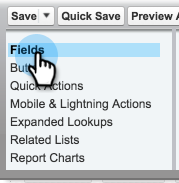

# Synchronisieren von Abmeldungen mit [!DNL Salesforce] {#syncing-unsubscribes-with-salesforce}

## Voraussetzungen für Abmeldungen zur Synchronisierung mit [!DNL Salesforce] {#requirements-for-unsubscribes-to-sync-to-salesforce}

* Abmeldesynchronisierung muss aktiviert sein (für die nächtliche Synchronisierung)
* Das Opt-out-Feld muss in [!DNL Salesforce] installiert sein
* Personendatensätze in [!DNL Sales Connect] müssen eine [!DNL Salesforce] ID haben

**Push-Abmeldungen**

Wenn in [!DNL Sales Connect] ein Abo storniert wird, pushen wir es in Echtzeit an [!DNL Salesforce] und aktualisieren eines der Opt-out-Felder, die Sie für die Synchronisierung ausgewählt haben. Wenn Sie die [!DNL Salesforce] deaktiviert haben, pushen wir das Abo-Abo dennoch an die E-Mail-Abmeldung.

**Abo-Synchronisierung**

Wenn Sie die Abmeldesynchronisierung aktiviert haben (Schritt 3 unten), schalten Sie die nächtliche Synchronisierung ein. Die Synchronisation erfolgt einmal täglich um 20:0000 Uhr PST. Alle Abmeldungen in Marketo Sales werden bidirektional mit dem Opt-out-Feld in Salesforce synchronisiert.

## Konfigurieren von Abmeldesynchronisierung mit [!DNL Salesforce] {#configure-unsubscribe-sync-to-salesforce}

Benutzerinnen und Benutzer können entscheiden, ob sie ihre Abmeldungen mit dem standardmäßigen E-Mail-Opt-out-Feld synchronisieren möchten, mit dem Marketo auch synchronisieren kann, oder sie können mit dem Marketo-Feld Verkaufsabmeldung synchronisieren, sodass Verkaufsabmeldungen und Marketing-Abmeldungen unterschieden werden können.

1. Wechseln Sie zur [Web-Anwendung](https://toutapp.com/login), klicken Sie auf das Zahnradsymbol und wählen Sie **[!UICONTROL Einstellungen]** aus.

   

1. Wählen [!UICONTROL &#x200B; unter „Admin]Einstellungen die Option **[!UICONTROL Abmeldungen]** aus.

   

1. Klicken Sie **[!UICONTROL Mit Salesforce synchronisieren]** und aktivieren Sie dann die nächtliche Synchronisierung.

   

1. Wählen Sie das Feld aus, mit dem Sie synchronisieren möchten.

   

   | Feld | Beschreibung |
   |---|---|
   | **[!UICONTROL Opt-out-Feld mit Salesforce synchronisieren]** | Standardmäßig ausgewählt. Nur [!DNL Salesforce] Feld „Opt-out“ wird aktualisiert. |
   | **[!UICONTROL Feld „Mit Marketo Sales Opt-out synchronisieren“]** | Wenn Sie Verkaufs- und Marketing-Abmeldungen trennen möchten, wählen Sie diese Option, um das zusätzliche Feld [Marketo-Verkaufsabmeldung zu aktualisieren.](#msoo) |

## Installieren des Opt-out-Felds im Seiten-Layout {#installing-the-opt-out-field-in-the-page-layout}

**E-Mail-Opt-out**

„E-Mail-Opt-out“ ist ein Standardfeld in [!DNL Salesforce], das über [!DNL Salesforce] installiert werden kann. Sie müssen [!DNL Salesforce] sein, um es zu installieren.

1. Wechseln Sie zu [Salesforce.com](https://salesforce.com) und melden Sie sich an.

   

1. Klicken Sie auf Ihren Benutzernamen und wählen Sie **[!UICONTROL Setup]**.

   

1. Suchen Sie im Feld „Schnellsuche“ nach Kontakt oder Lead. In diesem Szenario installieren wir das Feld im Layout Kontaktseite , Sie sollten es jedoch für beide Personendatensätze installieren.

   

1. Wählen Sie **[!UICONTROL Seitenlayouts]** aus.

   

1. Klicken Sie **[!UICONTROL Bearbeiten]** neben dem Seitenlayout, dem Sie das Feld hinzufügen möchten.

   

1. Wählen Sie **[!UICONTROL Felder]** aus.

   

1. Ziehen Sie „E[!UICONTROL Mail-Abmeldung] per Drag-and-Drop in das Seitenlayout.

   

1. Klicken Sie auf **[!UICONTROL Speichern]**.

   

## Abmeldung von Marketo Sales {#marketo-sales-opt-out}

Das Feld Marketo-Verkaufsabmeldung ist ein benutzerdefiniertes Feld, das Benutzenden zur Verfügung steht, die die Marketo [!DNL Sales Connect]-Anpassungen installiert haben.

Nachdem Sie die Marketo [!DNL Sales Connect]-Anpassungen erfolgreich in installiert haben, wird [!DNL Salesforce] Feld Marketo-Verkaufsabmeldung angezeigt, das Ihnen zur Verfügung steht.
