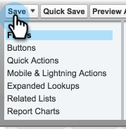

# Synchronisieren von Abonnements mit Salesforce {#syncing-unsubscribes-with-salesforce}

## Voraussetzungen für die Synchronisierung mit Salesforce {#requirements-for-unsubscribes-to-sync-to-salesforce}

* Synchronisierung abmelden muss aktiviert sein (für nächtliche Synchronisierung)
* Opt-out Feld muss in Salesforce installiert werden
* Personenaufzeichnungen in Sales Connect müssen über eine Salesforce-ID verfügen

**Push-Abonnements**

Wenn ein Abmelden in Sales Connect gesammelt wird, senden wir es in Echtzeit an Salesforce und aktualisieren eines der Opt-out Felder, mit denen Sie synchronisieren möchten. Wenn Sie die Salesforce-Synchronisierung deaktiviert haben, werden wir das Abbestellen trotzdem auf die E-Mail-Opt-out verschieben.

**Synchronisierung abmelden**

Wenn Sie die Synchronisierung zum Abmelden aktiviert haben (Schritt 3 unten), wird die Synchronisierung der Nacht aktiviert. Die Synchronisierung findet einmal täglich um 20.00 Uhr PST statt. Es synchronisiert alle Abmeldevorgänge in MSE/ToutApp bidirektional mit dem Opt-out in Salesforce.

## Synchronisierung zum Abmelden auf Salesforce konfigurieren {#configure-unsubscribe-sync-to-salesforce}

Benutzer können entscheiden, ob sie ihre Abmeldung mit dem standardmäßigen Feld E-Mail-Opt-out synchronisieren möchten, mit dem Marketo ebenfalls synchronisieren kann, oder sie können mit dem Feld Marketing Sales Opt-out synchronisieren, sodass Abmeldeabbrüche und Marketingabmeldungen differenziert werden können.

1. Wechseln Sie zur Webanwendung [und klicken Sie auf das Zahnradsymbol und wählen Sie **Einstellungen**.](http://toutapp.com/login)

   

1. Wählen Sie unter &quot;Admin-Einstellungen&quot;die Option **Abmelden**.

   

1. Klicken Sie auf **Synchronisieren mit Salesforce** und aktivieren Sie dann die nächtliche Synchronisierung.

   

1. Wählen Sie das Feld aus, mit dem Sie synchronisieren möchten.

   

   | **Opt-out synchronisieren** | Standardmäßig ausgewählt, wird nur das Feld Salesforce Opt-out aktualisiert. |
   |---|---|
   | **Synchronisierung mit dem Opt-out** | Wenn Sie die Abonnements für Vertrieb und Marketing trennen möchten, wählen Sie diese Option, um das weitere Feld [Marketingto Sales Opt-out zu aktualisieren.](#msoo) |

## Opt-out im Seitenlayout {#installing-the-opt-out-field-in-the-page-layout} installieren

**Opt-out**

Email Opt-out ist ein Standardfeld in Salesforce, das von Salesforce installiert werden kann. Sie müssen ein Salesforce-Administrator sein, um es zu installieren.

1. Gehen Sie zu [Salesforce.com](http://Salesforce.com) und melden Sie sich an.

   

1. Klicken Sie auf Ihren Benutzernamen und wählen Sie **Setup**.

   

1. Suchen Sie im Schnellsuchfeld nach Kontakt oder Interessent. In diesem Szenario installieren wir das Feld im Kontaktseitenlayout, aber Sie möchten es für beide Personendaten installieren.

   

1. Wählen Sie **Seitenlayouts**.

   

1. Wählen Sie **Bearbeiten** neben dem Seitenlayout, dem Sie das Feld hinzufügen möchten.

   

1. Wählen Sie **Felder** aus.

   

1. Ziehen Sie E-Mail-Opt-out in das Seitenlayout.

   

1. Klicken Sie auf **Speichern**.

   

## Marketo Sales Opt-out {#marketo-sales-opt-out}

Das Feld Marketing Opt-out ist ein benutzerdefiniertes Feld, das Benutzern zur Verfügung steht, die die Marketing Connect-Anpassungen installiert haben.

Nachdem Sie die Marketing Sales Connect Customizations erfolgreich in Salesforce installiert haben, sehen Sie das Feld Marketing Sales Opt-out.
