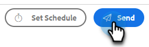

# E-Mail-Vorlagen für Transaktionsverkäufe {#transactional-sales-email-templates}

Wenn Ihr Team Transaktions- oder nicht-kommerzielle E-Mails versendet, können Sie eine E-Mail-Vorlage als nicht-kommerziell markieren, damit Abmeldungen umgangen werden können.

## Zu beachtende Punkte {#things-to-note}

* Nicht-kommerzielle E-Mails umgehen die Abmeldungen von Verkäufen und den [Marketo Engage-Abmelde-Check](/help/marketo/product-docs/marketo-sales-connect/email/unsubscribes/marketo-unsubscribe-check.md){target="_blank"}, umgehen jedoch nicht [blockierte Domains](/help/marketo/product-docs/marketo-sales-connect/admin/blocked-domains.md){target="_blank"}.

* Abmelde-Nachrichten werden nicht automatisch an nicht-kommerzielle E-Mails angehängt, auch wenn die [Admin zum Abmelden von Nachrichten anhängen](/help/marketo/product-docs/marketo-sales-connect/email/unsubscribes/auto-append-unsubscribe-message-setting.md){target="_blank"} aktiviert ist. Das Feld `{{team_unsubscribe}}`Dynamisch[ füllt jedoch weiterhin ](/help/marketo/product-docs/marketo-sales-connect/templates/dynamic-fields/dynamic-fields-glossary.md){target="_blank"} Nachricht zur Abmeldung Ihres Teams auf.

## Konfigurieren einer E-Mail-Vorlage für die nicht-kommerzielle Verwendung {#configure-an-email-template-for-non-commercial-use}

1. Klicken Sie in der Kopfzeile auf **Vorlagen**.

   

1. Suchen Sie die Vorlage, die Sie aktualisieren möchten, und wählen Sie sie aus.

   

1. Aktivieren Sie unter Vorlageneinstellungen den Umschalter Nicht-kommerzielle E-Mail .

   

## Senden einer nicht-kommerziellen E-Mail {#send-a-non-commercial-email}

>[!NOTE]
>
>Wenn eine abgemeldete Person ausgewählt wird, wird sie orange hervorgehoben.

1. Klicken Sie in der Kopfzeile auf **Erstellen**. Suchen Sie die gewünschte nicht-kommerzielle Vorlage und wählen Sie sie aus.

   

1. Benutzende sehen ein Banner, das ihnen zeigt, dass sie eine nicht-kommerzielle E-Mail-Vorlage ausgewählt haben.

   

1. Klicken Sie auf **Senden**.

   

Die E-Mail wird auch dann gesendet, wenn die Person das Abonnement gekündigt hat.
