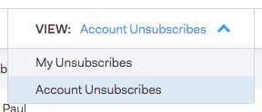

# Gruppe abmelden {#unsubscribe-group}

Alle abgemeldeten Personen an einem Ort anzeigen und verwalten.

Verwenden Sie die Suchleiste, um nach abgemeldeten Personen zu suchen.

Wenn Sie Administrator sind, können Sie zur Abmeldegruppe gehen, um nach [!UICONTROL Konto-Abmeldungen] zu filtern und alle Abmeldungen anzuzeigen, die in Ihrer Personendatenbank erfasst wurden.

