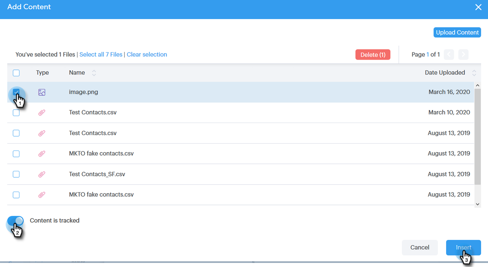

# Hinzufügen eines Anhangs oder verfolgbarer Inhalte zu einer E-Mail {#add-an-attachment-or-trackable-content-to-your-email}

Beim Versand einer E-Mail über [!DNL Sales Connect] haben Sie die Möglichkeit, eine Datei als Anhang hinzuzufügen oder eine Datei zu einem herunterladbaren (und verfolgbaren) Link zu machen.

>[!NOTE]
>
>In der Regel ist jede Datei über 20 MB zu groß für die Bereitstellung. Die Größe eines Anhangs, der per E-Mail gesendet werden kann, hängt vom verwendeten E-Mail-Versandkanal ab.

## Anlage hinzufügen {#add-an-attachment}

1. Erstellen Sie Ihren E-Mail-Entwurf (es gibt mehrere Möglichkeiten, dies zu tun, in diesem Beispiel wählen wir **[!UICONTROL Erstellen]** in der Kopfzeile).

   

1. Füllen Sie das Feld [!UICONTROL An] aus und geben Sie einen [!UICONTROL Betreff] ein.

   

1. Klicken Sie auf das Anlagensymbol.

   

1. Wählen Sie die angehängte Datei aus und klicken Sie auf **[!UICONTROL Einfügen]**.

   

   >[!NOTE]
   >
   >Wenn Sie eine Datei hochladen müssen, klicken Sie auf **Schaltfläche** Inhalt hochladen“ oben rechts im Fenster.

   

Der Anhang wird unten in der E-Mail angezeigt.

## Tracking-Inhalte hinzufügen {#add-trackable-content}

1. Erstellen Sie Ihren E-Mail-Entwurf (es gibt mehrere Möglichkeiten, dies zu tun, in diesem Beispiel wählen wir das Fenster [!UICONTROL Erstellen]).

   

1. Füllen Sie das Feld [!UICONTROL An] aus und geben Sie einen [!UICONTROL Betreff] ein.

   

1. Klicken Sie auf die Stelle in der E-Mail, an der der verfolgbare Inhalt angezeigt werden soll, und klicken Sie dann auf das Anlagensymbol.

   

1. Wählen Sie den hinzuzufügenden Inhalt aus, klicken Sie auf den **[!UICONTROL Inhalt wird verfolgt]** und klicken Sie auf **[!UICONTROL Einfügen]**.

   

   >[!NOTE]
   >
   >Wenn Sie eine Datei hochladen müssen, klicken Sie auf **Schaltfläche** Inhalt hochladen“ oben rechts im Fenster.

   Der Inhalt wird als Link in Ihrer E-Mail angezeigt. Der Empfänger kann auf den Link klicken, um den Inhalt herunterzuladen.

   

   >[!NOTE]
   >
   >Benutzer werden im Live-Feed benachrichtigt, wenn Benutzer ihre verfolgten Inhalte anzeigen. Benutzer können auch den Inhalt mit der höchsten Leistung im Abschnitt Inhalt der Analytics-Seite sehen.
