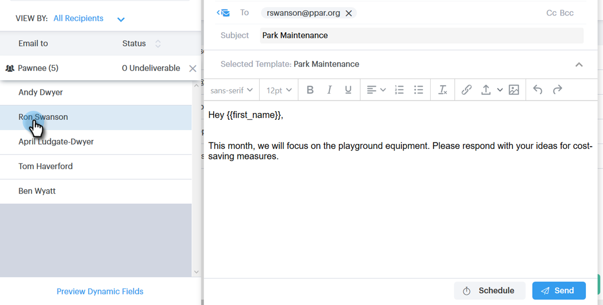

# E-Mails über Gruppen-E-Mails senden {#sending-emails-via-group-email}

So senden/bearbeiten Sie E-Mails mit der Option Gruppen-E-Mail .

## Senden einer Gruppen-E-Mail {#sending-a-group-email}

1. Klicken Sie auf die **Personen**.

   

1. Wählen Sie die Gruppe aus, die Sie per E-Mail versenden möchten.

   

1. Klicken Sie auf die Schaltfläche Gruppenaktionen und wählen Sie **E-Mail-Gruppe**.

   

1. Füllen Sie Ihre E-Mail aus (oder wählen Sie eine Vorlage aus) und senden (oder planen) Sie sie.

   

## E-Mail-Gruppe bearbeiten {#editing-a-group-email}

1. Erstellen Sie eine Gruppen-E-Mail mit [Schritten 1-3 oben](#sending-a-group-email).

1. Wählen Sie eine Vorlage aus oder füllen Sie Ihre E-Mail aus.

   

1. Sobald die E-Mail abgeschlossen ist, können Sie jetzt jede E-Mail in der Liste in der Vorschau anzeigen, um festzustellen, ob die dynamischen Felder korrekt ausgefüllt werden.

   

1. Wählen Sie den gewünschten Empfänger aus.

   

1. Klicken Sie auf **Dynamische Felder in Vorschau anzeigen** und zeigen Sie die Vorschau rechts an.

   

   >[!NOTE]
   >
   >Sie können beim Versenden einer Gruppen-E-Mail Massenbearbeitungen an der E-Mail/Vorlage vornehmen, aber Sie können keine eindeutigen Änderungen für bestimmte Empfängerinnen und Empfänger in der Liste vornehmen.

>[!MORELIKETHIS]
>
>* [Massenversand-Optionen](/help/marketo/product-docs/marketo-sales-connect/email/using-the-compose-window/bulk-sending-options.md)
>* [Verwenden einer Vorlage im Fenster „Erstellen“](/help/marketo/product-docs/marketo-sales-connect/email/using-the-compose-window/using-a-template-in-the-compose-window.md)
