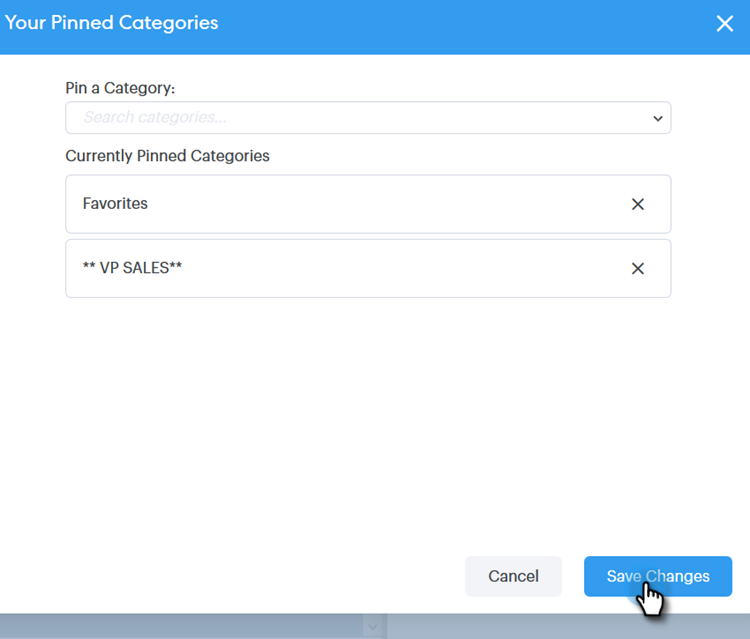

# Verwenden einer Vorlage im Fenster &quot;Erstellen&quot; {#using-a-template-in-the-compose-window}

## Suchen und Verwenden von Vorlagen {#finding-and-using-templates}

1. Erstellen Sie Ihren E-Mail-Entwurf (dazu gibt es mehrere Möglichkeiten, in diesem Beispiel wählen wir **Erstellen** in der Kopfzeile).

   

1. Füllen Sie das Feld An aus.

   

1. Klicken Sie auf das Suchsymbol im Vorlagenbereich, um das Vorlagensuchfeld zu öffnen.

   

1. Wählen Sie eine Kategorie aus, in der gesucht werden soll (oder wählen Sie Alle aus, um alle Kategorien zu durchsuchen).

   

1. Suche nach Vorlagenname, Betreffzeile oder Hauptteil der E-Mail. Klicken Sie auf die gewünschte Vorlage, um sie auszuwählen.

   

   >[!NOTE]
   >
   >Wenn Sie eine andere Vorlage auswählen, werden alle derzeit im Editor vorhandenen Informationen ersetzt. Wenn Sie Änderungen vornehmen, müssen Sie diese unbedingt kopieren, bevor Sie eine andere Vorlage auswählen.

## Veröffentlichen von Vorlagenkategorien im Fenster &quot;Erstellen&quot; {#pinning-template-categories-in-the-compose-window}

Favoriten Sie **bis zu fünf** spezifische Vorlagenkategorien, um schnell auf Ihre am häufigsten verwendeten Vorlagen zugreifen zu können.

1. Erstellen Sie Ihren E-Mail-Entwurf (dazu gibt es mehrere Möglichkeiten, in diesem Beispiel wählen wir **Erstellen** in der Kopfzeile).

   

1. Klicken Sie auf das Symbol **+** neben Favoriten.

   

1. Klicken Sie auf das Dropdown-Menü **Kategorie veröffentlichen** und wählen Sie die gewünschte Kategorie aus.

   

1. Klicken Sie abschließend auf **Änderungen speichern** (optional: Wiederholen Sie Schritt 3, um weitere Änderungen hinzuzufügen).

   

   >[!TIP]
   >
   >Sie können die eingefügten Kategorien einfach durch Ziehen und Ablegen neu anordnen, bevor Sie Ihre Änderungen speichern.

   

   >[!NOTE]
   >
   >**Favoriten** ist standardmäßig vorhanden. Sie enthält bevorzugte E-Mail-Vorlagen, keine Kategorien.

   Ihre ausgewählte Kategorie ist jetzt fixiert.
