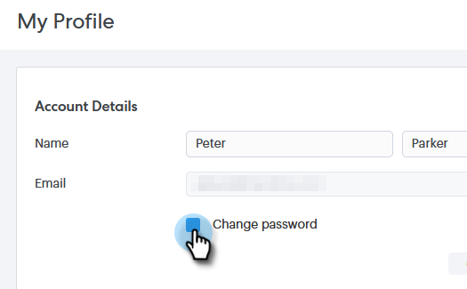
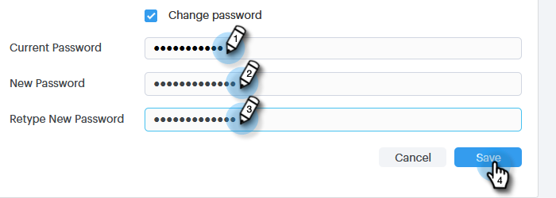

# Passwort für Sales Connect ändern {#change-your-sales-connect-password}

Müssen Sie Ihr Passwort ändern? So geht&#39;s.

## Ändern des Passworts bei Anmeldung {#change-your-password-while-signed-in}

1. Klicken Sie auf das Zahnradsymbol und wählen Sie **Einstellungen** aus.

   

1. Die Seite „Mein Profil“ wird standardmäßig geöffnet. Aktivieren Sie unter Kontodetails das Kontrollkästchen **Kennwort ändern**.

   

1. Geben Sie Ihr aktuelles Kennwort ein. Geben Sie dann Ihre neue ein, und geben Sie sie erneut ein, um sicherzustellen, dass sie übereinstimmen. Klicken Sie auf **Speichern**, wenn Sie fertig sind.

   

>[!NOTE]
>
>Kennwörter müssen:
>
>* enthält mindestens neun Zeichen
>* Gemischte Groß-/Kleinschreibung verwenden (sowohl oben als auch unten)
>* Zahl einschließen
>* Sonderzeichen verwenden

## Ändern des Kennworts bei Abmeldung {#change-your-password-while-signed-out}

1. Navigieren Sie zur Seite [Sales Connect-Anmeldung](https://toutapp.com/login) und klicken Sie auf **Kennwort vergessen**.

   

1. Geben Sie die mit dem Konto verknüpfte E-Mail-Adresse ein und klicken Sie auf **E-Mail zurücksetzen**.

   

1. Wir senden eine E-Mail, um zu bestätigen, dass der Kontoinhaber das Passwort ändern möchte. Klicken Sie **Kennwort zurücksetzen**.

   

   >[!NOTE]
   >
   >Überprüfen Sie unbedingt auch Ihren Spam-Ordner, da diese E-Mail manchmal dort landen kann.

1. Geben Sie Ihr neues Kennwort ein und bestätigen Sie es. Klicken Sie abschließend **Kennwort festlegen**.

   
