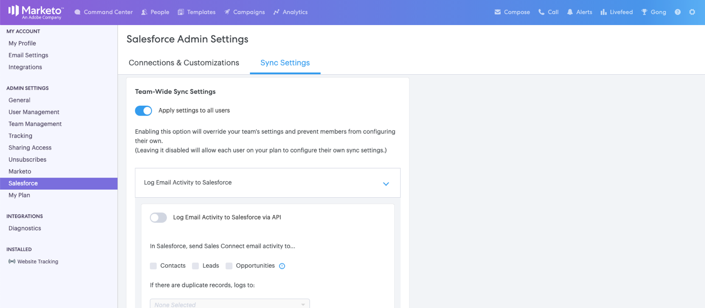

# Erste Schritte für Sales Connect-Administratoren {#getting-started-guide-for-sales-connect-admins}

In diesem Dokument werden die ersten Schritte zum Einrichten der neuen Sales Connect-Instanz beschrieben. Einige dieser Schritte erfordern den Zugriff als Marketo-Administrator, Salesforce-Administrator und Sales Connect-Administrator. Befolgen Sie unsere unten stehenden Anleitungen, um Ihre Instanzeinrichtung abzuschließen.

>[!NOTE]
>
>**Erforderliche Administratorberechtigungen.**

## Zugriff auf Ihr neues Marketo Sales Connect-Konto {#accessing-your-new-marketo-sales-connect-account}

Wenn Sie Marketo Sales Connect erworben haben, wird der Zugriff auf Ihre Instanz über den Administratorbereich von Marketo bereitgestellt. [Klicken Sie hier](/help/marketo/product-docs/marketo-sales-connect/getting-started/accessing-your-new-sales-connect-instance.md) , um Anweisungen dazu zu erhalten, wie ein Marketo-Administrator den Zugriff auf Ihre neue Instanz bereitstellen kann.

## Einladen und Verwalten von Benutzern {#inviting-and-managing-users}

Nachdem Sie Ihr Marketo Sales Connect-Konto von Marketo bereitgestellt und Ihren ersten Admin-Benutzer eingeladen haben, kann dieser Admin-Benutzer weitere Benutzer über die Benutzerverwaltungsseite von Marketo Sales Connect einladen. [Klicken Sie hier](/help/marketo/product-docs/marketo-sales-connect/admin/invite-users.md) , um zu sehen, wie Benutzer von der Benutzerverwaltungsseite eingeladen werden.

## Verbindung zu Salesforce {#connecting-to-salesforce}

Alle Benutzer müssen einzeln eine Verbindung zu Salesforce herstellen, um Log-Verkaufsaktivitäten zu ermöglichen, damit sie beispielsweise E-Mails, Aufrufe und Aufgaben erzwingen können. Wenn Sie sich jedoch als Administrator mit Salesforce verbinden, können Sie Ihre Aktivitätsprotokolleinstellungen für Ihr gesamtes Team konfigurieren, sodass die globalen Protokollierungseinstellungen auf alle Sales Connect-Benutzer angewendet werden.

Um Ihre Sales Connect-Instanz mit Ihrer Salesforce-Instanz als Administrator oder Nicht-Administrator zu verbinden, führen Sie die Schritte in [diesem Artikel](/help/marketo/product-docs/marketo-sales-connect/crm/salesforce-integration/connect-your-sales-connect-account-to-salesforce.md) aus.

## Herstellen einer Verbindung zu Marketo {#connecting-to-marketo}

Durch die Verbindung mit Marketo können Ihre Verkäufer die Vorteile von Marketing-Automatisierung und Marketing-Einblicken bei ihren Prospektionsbemühungen nutzen. Für die folgenden Funktionen müssen Sie eine Integration mit Marketo einrichten.

* [Marketing-Kampagnen](/help/marketo/product-docs/marketo-sales-connect/marketo/make-a-campaign-visible-to-sales-connect-users.md) für Verkäufer freigeben
* Push [Interessante Momente](/help/marketo/product-docs/marketo-sales-connect/marketo/interesting-moments-in-sales-connect.md) in den Live-Feed
* Protokollieren von Verkaufsaktivitäten in Marketo

Um mehr darüber zu erfahren, wie Sie eine Verbindung zu Marketo herstellen und Vertriebsbenutzern Zugriff auf die Verbindung gewähren, klicken Sie hier.

## Installation des Salesforce-Anpassungspakets {#installing-salesforce-customization-package}

Ein Teil der erfolgreichen Aktivierung von Umsätzen bedeutet, dass in ihrem primären Arbeitsbereich die richtigen Funktionen vorhanden sind. Das Individualisierungspaket Sales Connect ermöglicht den Zugriff auf Interaktionsfunktionen und wichtige Attribute der Verkaufsaktivität über Salesforce.

Weitere Informationen zum Installieren der Anpassung von Sales Connect finden Sie hier ](/help/marketo/product-docs/marketo-sales-connect/crm/salesforce-customization/sales-connect-customizations-for-crm.md).[

## Testen in Sandbox {#testing-in-sandbox}

Teams, die Marketo Sales Connect mit ihrer Marketo-Sandbox testen möchten, können auf Anfrage ein zusätzliches Sales Connect-Konto bereitstellen. Dies gilt nur für Kunden, die eine Marketo-Sandbox erworben haben oder die diese als Teil ihres Marketo-Bundles haben. Wenden Sie sich an Ihren Marketo-Kundenbetreuer, wenn Sie daran interessiert sind, eine Sandbox zu erwerben.

>[!NOTE]
>
>Sie können kein Sales Connect-Konto mit derselben E-Mail-ID für mehrere Instanzen bereitstellen. Wenn Sie also ein zusätzliches Sales Connect-Konto wünschen, um es mit Ihrer Marketo Sandbox-Instanz zu testen, müssen Sie in jedem Konto eine andere E-Mail-ID verwenden.

>[!MORELIKETHIS]
>
>[Administratorberechtigungen](/help/marketo/product-docs/marketo-sales-connect/admin/user-access-details.md)
