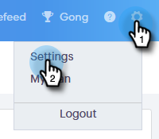

# Profil verwalten {#manage-your-profile}

Auf Ihrer Seite &quot;Mein Profil&quot;können Sie Ihren Namen, die Sprache/das Gebietsschema/die Zeitzone Ihres Kontos sowie Ihr Kennwort aktualisieren.

## Kontodetails {#account-details}

Hier können Sie Ihren Namen und/oder Ihr Passwort aktualisieren.

1. Klicken Sie auf das Zahnradsymbol und wählen Sie **Einstellungen**.

   

1. Ihre Seite &quot;Mein Profil&quot;wird standardmäßig geöffnet. Um Ihren Namen zu aktualisieren, geben Sie einfach die Änderungen ein und klicken Sie auf **Speichern**.

   

>[!NOTE]
>
>Ihre E-Mail-Adresse ist so eingestellt, dass sie nur angezeigt wird. Wenn Sie auch eine Änderung benötigen, wenden Sie sich bitte an [Marketo-Support](https://nation.marketo.com/t5/Support/ct-p/Support).

Sie können Ihr Kennwort auch in diesem Abschnitt ändern. Die Schritte sind in diesem Dokument beschrieben.

## Ihre Integrationen {#your-integrations}

Rechts auf der Seite zeigt der Abschnitt Ihre Integrationen den Status aller Verbindungen Ihres Kontos an.

>[!NOTE]
>
>Wenn Sie Exchange On Prem mit Sales Connect verwenden, werden die Konsistenzprüfungen für die Integration von Versandkanal (1. Zeileneintrag) oder Antwort-Tracking (2. Zeileneintrag) nicht aktualisiert. Wir arbeiten daran, dies in einer zukünftigen Version zu unterstützen.

## Zeitzone {#time-zone}

Hier erfahren Sie, wie Sie die Sprache, das Gebietsschema und/oder die Zeitzone Ihres Kontos ändern können.

>[!NOTE]
>
>Unterstützte Sprachen: Englisch, Französisch, Deutsch, Japanisch, Portugiesisch, Spanisch.

1. Klicken Sie auf das Zahnradsymbol und wählen Sie **Einstellungen**.

   

1. Um Ihre Sprache zu ändern, klicken Sie auf die Schaltfläche **Sprache** und wählen Sie aus.

   

1. Gebietsschema hier bezieht sich auf die Region, in der diese Sprache gesprochen wird. Klicken Sie auf **Gebietsschema** und wählen Sie aus.

   

1. Klicken Sie auf **Ihre Zeitzone** und wählen Sie aus.

   

1. Klicken **Speichern** wann geschehen.

   

Et voilà!
