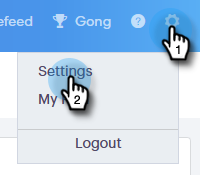
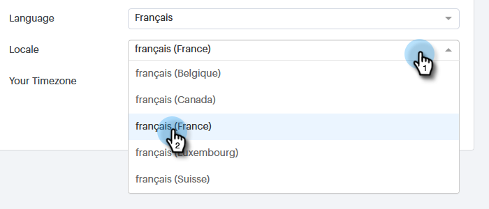

# Meine Profil-Seite {#my-profile-page}

Auf Ihrer Seite &quot;Mein Profil&quot;können Sie Ihren Namen, die Sprache/das Gebietsschema/die Zeitzone Ihres Kontos sowie Ihr Passwort ändern.

## Kontodetails {#account-details}

Hier können Sie Ihren Namen und/oder Ihr Passwort aktualisieren.

1. Klicken Sie auf das Zahnradsymbol und wählen Sie **Einstellungen**.

   

1. Ihre Seite &quot;Mein Profil&quot;wird standardmäßig geöffnet. Um Ihren Namen zu aktualisieren, geben Sie einfach die Änderungen ein und klicken Sie auf **Speichern**.

   

>[!NOTE]
>
>Ihre E-Mail-Adresse ist nur auf Ansicht eingestellt. Wenn Sie auch diese Änderung benötigen, wenden Sie sich bitte an [Marketing Support](https://nation.marketo.com/t5/Support/ct-p/Support).

Sie können Ihr Passwort auch in diesem Abschnitt ändern. Die Schritte sind in diesem Dokument beschrieben.

## Ihre Integrationen {#your-integrations}

Auf der rechten Seite der Seite finden Sie im Abschnitt &quot;Ihre Integrationen&quot;den Status aller Verbindungen Ihres Kontos.

>[!NOTE]
>
>Wenn Sie Exchange on Prem mit Sales Connect verwenden, wird der Integrationsstatus des Versand-Kanals (1. Zeile) oder der Antwort-Verfolgung (2. Zeile) nicht aktualisiert. Wir arbeiten daran, dies in einer zukünftigen Version zu unterstützen.

## Zeitzone {#time-zone}

So ändern Sie die Sprache, das Gebietsschema und/oder die Zeitzone Ihres Kontos.

>[!NOTE]
>
>Unterstützte Sprachen: Englisch, Französisch, Deutsch, Japanisch, Portugiesisch, Spanisch.

1. Klicken Sie auf das Zahnradsymbol und wählen Sie **Einstellungen**.

   

1. Um Ihre Sprache zu ändern, klicken Sie auf die Dropdownliste **Sprache** und wählen Sie aus.

   

1. Das Gebietsschema hier bezieht sich auf die Region, in der diese Sprache gesprochen wird. Klicken Sie auf die Dropdownliste **Gebietsschema** und wählen Sie aus.

   

1. Klicken Sie auf die Dropdownliste **Ihre Zeitzone** und wählen Sie aus.

   

1. Klicken Sie abschließend auf **Speichern**.

   

Et voilà!
