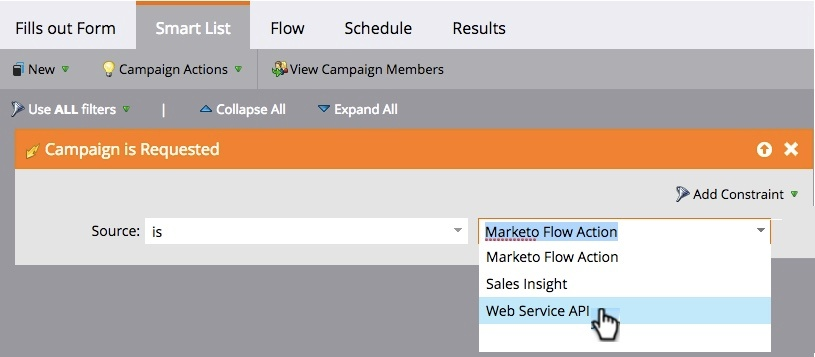

# Sales Connect – Überblick {#sales-connect-overview}

Marketo Sales Connect ist eine vielseitige Sales Support-Lösung mit einer Vielzahl von Funktionen, die Ihnen hilft, das Engagement während des gesamten Verkaufszyklus zu steigern.

>[!AVAILABILITY]
>
>Nicht jeder hat diese Funktion erworben. Weitere Informationen erhalten Sie beim Adobe Account Team (Ihrem Account Manager).

## Der Live-Feed {#the-live-feed}

Vertriebsmitarbeiter können [ (Echtzeit-Interaktion](/help/marketo/product-docs/marketo-sales-connect/email/the-live-feed/live-feed-overview.md) von Marketing- und Verkaufsinhalten anzeigen.

## Ansicht „Personendetails“ {#person-detail-view}

Zugriff [detaillierte Personenstatistiken](/help/marketo/product-docs/marketo-sales-connect/people/person-detail-view.md).

## Ergebnisse im Marketo-Aktivitätsprotokoll anzeigen {#see-results-in-your-marketo-activity-log}

Erfahren Sie, wie Ihre potenziellen Kunden mit Ihren Vertriebsaktivitäten interagieren.

<table>
 <tbody>
  <tr>
   <th>Aktivitätstyp</th>
   <th>Beschreibung</th>
  </tr>
  <tr>
   <td>
Verkaufs-E-Mail senden
</td>
   <td>
Der Benutzer hat eine Verkaufs-E-Mail von Sales Connect gesendet.
</td>
  </tr>
  <tr>
   <td>
Verkaufs-E-Mail öffnen
</td>
   <td>
Lead hat eine Verkaufs-E-Mail geöffnet, die von Sales Connect gesendet wurde.
</td>
  </tr>
  <tr>
   <td>
Auf Verkaufs-E-Mail klicken
</td>
   <td>
Lead hat auf einen Link in einer Verkaufs-E-Mail geklickt, die von Sales Connect gesendet wurde.
</td>
  </tr>
  <tr>
   <td colspan="1">
Verkaufs-E-Mail empfangen
</td>
   <td colspan="1">
Lead hat eine E-Mail von Sales Connect erhalten.
</td>
  </tr>
  <tr>
   <td colspan="1">
Empfangen Verkaufsanruf
</td>
   <td colspan="1">
Der Lead hat einen Anruf von einem Vertriebsmitarbeiter mit dem <a href="/help/marketo/product-docs/marketo-sales-connect/phone/sales-phone-overview.md" rel="nofollow">Telefon) </a>.
</td>
  </tr>
  <tr>
   <td colspan="1">
Zur Verkaufskampagne hinzufügen
</td>
   <td colspan="1">
Der Lead wurde zu einer in Sales Connect erstellten Verkaufskampagne hinzugefügt (auf der Seite Kampagnen ).
</td>
  </tr>
  <tr>
   <td colspan="1">
Aus der Kampagne entfernt
</td>
   <td colspan="1">
Lead wurde aus einer Verkaufskampagne entfernt.
</td>
  </tr>
  <tr>
   <td colspan="1">
Interessanter Moment
</td>
   <td colspan="1">
Lead hat einen interessanten Moment in Marketo erzeugt.
</td>
  </tr>
 </tbody>
</table>

## Marketing-Kampagnen freigeben {#share-marketing-campaigns}

Erstellen Sie eine einfache intelligente Kampagne, um Ihren Vertriebsmitarbeitern Zugriff auf [Marketo-Kampagnendaten zu ](/help/marketo/product-docs/marketo-sales-connect/marketo/make-a-campaign-visible-to-sales-connect-users.md).

Bereit zum Einstieg? Klicken Sie auf den folgenden Link, um Setup-Anweisungen anzuzeigen.

>[!MORELIKETHIS]
>
>[Erste Schritte für Sales Connect-Administratoren](/help/marketo/product-docs/marketo-sales-connect/getting-started/getting-started-guide-for-sales-connect-admins.md)
