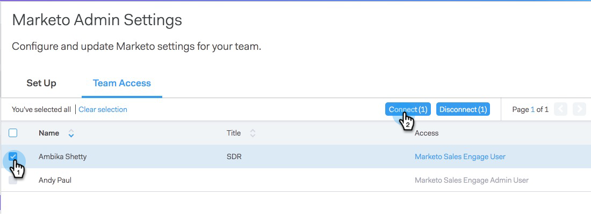
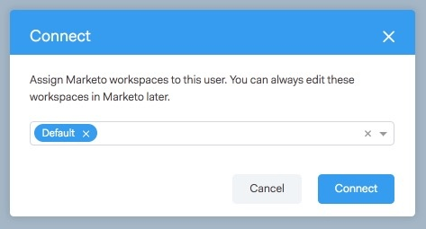
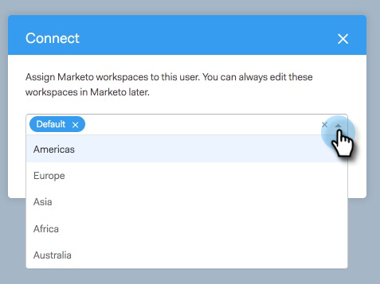

# Gewähren von Zugriff für Benutzende&#x200B; {#granting-access-to-users}

Gehen Sie wie in diesem Artikel beschrieben vor, um Ihren [!DNL Sales Connect] Zugriff auf die Marketo-Verbindung zu gewähren. Dadurch werden Funktionen wie „Interessante Momente“ im Live-Feed und der Zugriff auf Marketing-Kampagnen freigeschaltet.

Sie müssen Benutzer zu [!DNL Sales Connect] (hier[&#x200B; einladen](/help/marketo/product-docs/marketo-sales-connect/admin/invite-users.md) bevor sie auf der Seite Marketo > [!UICONTROL Team-Zugriff] (in [!DNL Sales Connect]) angezeigt werden, wo der Zugriff auf die Marketo-Verbindung gewährt wird.

>[!CAUTION]
>
>Bitte warten Sie 10 Minuten nach der Verbindung von [!DNL Sales Connect] mit Marketo, bevor Sie diese Schritte ausführen.

1. Wählen Sie einen oder mehrere Benutzer aus und klicken Sie dann auf **[!UICONTROL Verbinden]**.

   >[!NOTE]
   >
   >Sie können die Arbeitsbereichszuweisung nur einmal zum Zeitpunkt der Gewährung des Zugriffs für Benutzer durchführen. Nachdem er festgelegt wurde, müssen Sie den Benutzer trennen, um ihn zu ändern.

   

1. Wenn für Ihr Marketo-Abonnement Arbeitsbereiche aktiviert sind, können Sie jedem Benutzer bzw. jeder Benutzergruppe Arbeitsbereiche zuweisen. Wenn keine Arbeitsbereiche ausgewählt sind, weisen wir sie dem standardmäßigen Marketo-Arbeitsbereich zu.

   

1. Klicken Sie auf die Dropdown-Liste Workspace , wählen Sie die gewünschten Arbeitsbereiche aus und klicken Sie auf **[!UICONTROL Verbinden]**.

   

Sie können zusätzliche Benutzer über die Seite „Team-Verwaltung“ hinzufügen und die oben beschriebenen Schritte ausführen, um sie miteinander zu verbinden.
