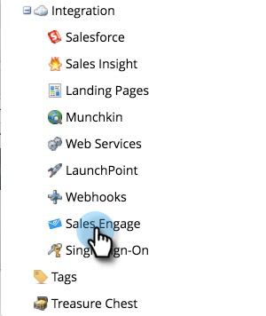

# Einrichten der Marketo-Verbindung {#set-up-your-marketo-connection}

>[!NOTE]
>
>Wenn Sie MSC bereitstellen, sendet Marketo Ihre Anmeldeinformationen automatisch an [!DNL Sales Connect] und verbindet Ihre Instanz mit Marketo. Dieser Schritt ist **erforderlich (nur, wenn die Verbindung nicht hergestellt**), nachdem Ihre [!DNL Sales Connect] bereitgestellt wurde. Wenn Ihre Verbindung hergestellt wurde, werden Ihre Anmeldedaten auf der Seite &quot;Marketo Admin-Einstellungen“ angezeigt.

## Erhalten von Anmeldeinformationen vor der Verbindung von [!DNL Sales Connect] mit Marketo {#acquiring-credentials-prior-to-connecting-sales-connect-with-marketo}

Sie müssen von Marketo aus einen Satz von Anmeldeinformationen abrufen. Diese Anmeldeinformationen werden später vom [!DNL Sales Connect]-Administrator verwendet, um eine Verbindung zwischen Marketo und [!DNL Sales Connect] herzustellen.

1. Klicken Sie in Marketo auf **[!UICONTROL Admin]**.

   

1. Klicken Sie in der Struktur auf **[!UICONTROL Vertriebsmitarbeiter]**.

   

1. Wählen Sie die folgenden Marketo-Anmeldeinformationen aus und senden Sie sie an Ihren [!DNL Sales Connect]-Administrator: [!UICONTROL Munchkin-Konto], [!UICONTROL Client-ID], [!UICONTROL Client-Geheimnis].

   

   >[!NOTE]
   >
   >Wenn Sie die obigen Informationen kopieren und einfügen, stellen Sie sicher, dass keine Leerzeichen hinzugefügt werden.

## Verbinden von [!DNL Sales Connect] mit Marketo {#connect-sales-connect-to-marketo}

1. Klicken Sie [!DNL Sales Connect] auf das Zahnradsymbol und wählen Sie **[!UICONTROL Einstellungen]** aus.

   

1. Wählen [!UICONTROL  unter „Admin] die Option **[!UICONTROL Marketo]**.

   

1. Geben Sie die vom Marketo-Administrator bereitgestellten Marketo-Anmeldeinformationen ein und klicken Sie auf **[!UICONTROL Verbinden]**.

   
