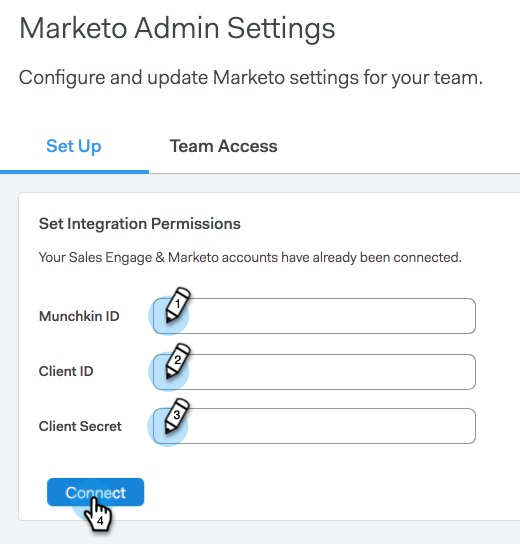

# Einrichten der Marketo-Verbindung {#set-up-your-marketo-connection}

>[!NOTE]
>
>Wenn Sie MSC bereitstellen, sendet Marketo Ihre Anmeldeinformationen automatisch an Sales Connect und verbindet Ihre Instanz mit Marketo. Dieser Schritt ist nur dann erforderlich, wenn die Verbindung nach der Bereitstellung Ihrer Sales Connect-Instanz nicht hergestellt wird. **** Wenn Ihre Verbindung hergestellt ist, werden Ihre Anmeldedaten auf der Seite &quot;Marketo-Administrationseinstellungen&quot;angezeigt.

## Berechtigungen vor der Verbindung von Vertrieb mit Marketo abrufen {#acquiring-credentials-prior-to-connecting-sales-connect-with-marketo}

Sie benötigen einen Satz Anmeldeinformationen aus Marketo. Diese Anmeldeinformationen werden später vom Sales Connect-Administrator verwendet, um Marketo mit Sales Connect zu verbinden.

1. Klicken Sie in Marketo auf **Admin**.

   

1. Klicken Sie in der Struktur auf **Verkaufsverbindung**.

   

1. Wählen Sie die folgenden Marketo-Anmeldedaten aus und senden Sie sie an Ihren Sales Connect-Administrator: Munchkin-ID, Client-ID, geheimer Clientschlüssel.

   

   >[!NOTE]
   >
   >Wenn Sie die oben genannten Informationen kopieren und einfügen, stellen Sie sicher, dass keine Leerzeichen hinzugefügt werden.

## Connect Sales Connect mit Marketo {#connect-sales-connect-to-marketo}

1. Klicken Sie in Sales Connect auf das Zahnradsymbol und wählen Sie **Einstellungen**.

   

1. Wählen Sie unter &quot;Admin-Einstellungen&quot;die Option **Marketo**.

   

1. Geben Sie die vom Marketo-Administrator angegebenen Marketo-Anmeldeinformationen ein und klicken Sie auf **Connect**.

   
