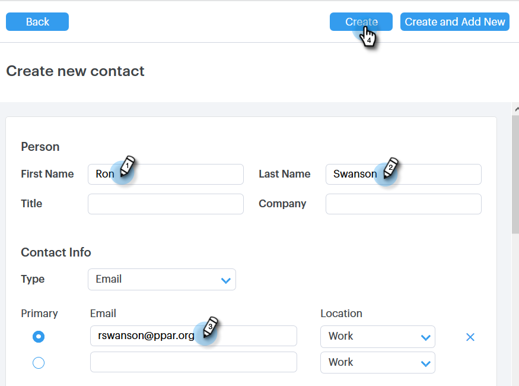

# Kontakte erstellen und löschen {#creating-and-deleting-contacts}

## Kontakte erstellen {#creating-contacts}

1. Klicken Sie auf der [!UICONTROL Personen]-Seite auf die Schaltfläche **[!UICONTROL Gruppenaktionen]** und wählen Sie **[!UICONTROL Kontakt erstellen]**.

   

1. Geben Sie den Vor-/Nachnamen und die E-Mail-Adresse sowie weitere Informationen ein, die Sie benötigen. Klicken Sie **[!UICONTROL Erstellen]** wenn Sie fertig sind, oder **[!UICONTROL Erstellen und Neu hinzufügen]** um weitere Kontakte hinzuzufügen.

   

   >[!TIP]
   >
   >Möchten Sie mehrere Kontakte gleichzeitig hinzufügen? [Hier klicken](/help/marketo/product-docs/marketo-sales-connect/people/managing-contacts/import-contacts-via-csv.md) um zu erfahren, wie Sie Kontakte per CSV importieren.

## Löschen von Kontakten {#deleting-contacts}

1. Aktivieren [!UICONTROL  auf der ] „Personen“ das Kontrollkästchen des Kontakts, den Sie löschen möchten.

   

   >[!NOTE]
   >
   >Um mehrere Kontakte zu löschen, wählen Sie einfach mehrere Personen aus. Die restlichen Schritte wären dieselben.

1. Klicken Sie auf die Punkte (drei vertikale Punkte) und wählen Sie **[!UICONTROL Löschen]**.

   

1. Klicken Sie **[!UICONTROL Kontakt löschen]** zur Bestätigung.

   
