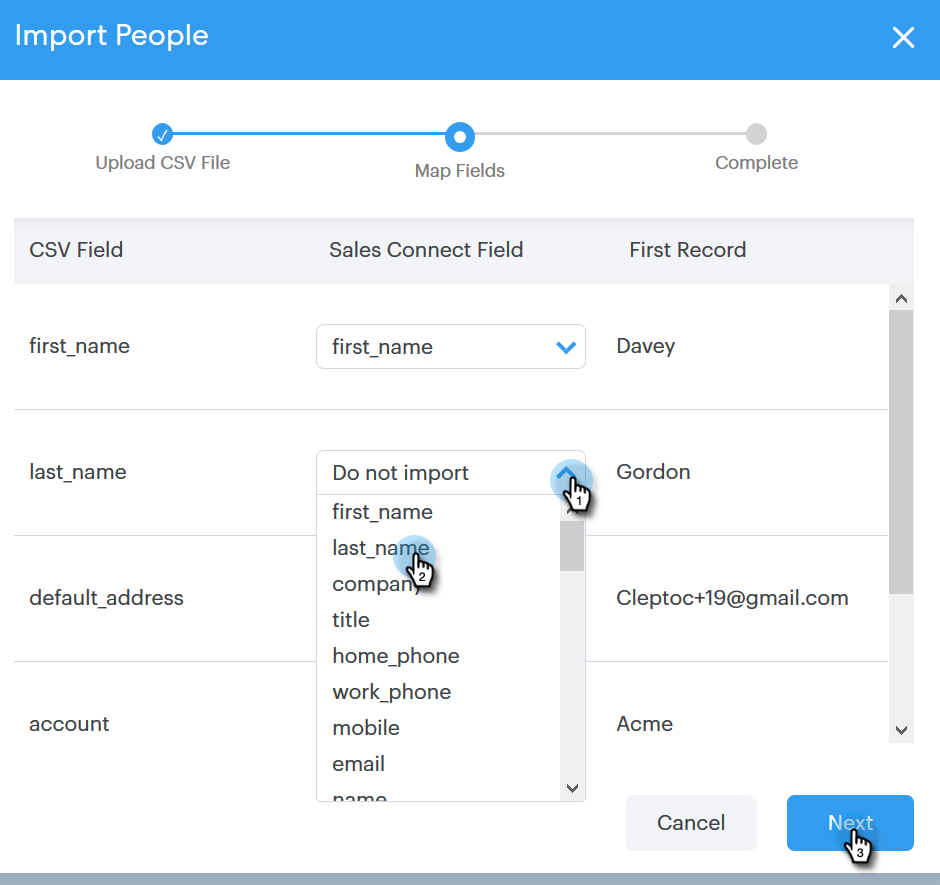

# Kontakte über CSV importieren {#import-contacts-via-csv}

Kontakte auf der Personen -Seite zu haben, ist wichtig, da hier die personalisierten Informationen in den dynamischen Feldern Ihrer Vorlagen automatisch ausgefüllt werden. Stellen Sie sicher, dass Sie mindestens einen Namen und eine E-Mail-Adresse für jeden Kontakt in Ihrer CSV-Datei haben und dass Sie diese Felder zuordnen.

1. Wählen Sie Ihre Gruppe (oder erstellen Sie eine neue) auf der Registerkarte Personen .

   

1. Klicken Sie auf **Gruppenaktionen** und wählen Sie **CSV importieren** aus.

   

1. Klicken Sie **Durchsuchen**.

   

1. Suchen Sie die Datei auf Ihrem Computer und wählen Sie sie aus.

   >[!NOTE]
   >
   >Gruppen sind auf 1000 Kontakte beschränkt.

1. Klicken Sie auf **Weiter**.

   

1. Ordnen Sie die Spalten in Ihrer CSV den entsprechenden Feldern in Sales Connect zu. Klicken Sie abschließend **Weiter**.

   
