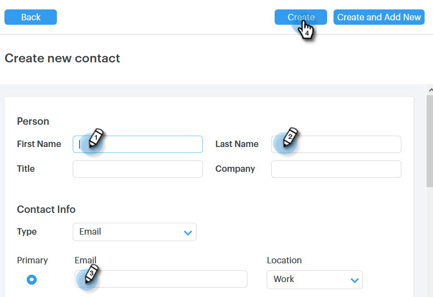

# Gruppen verwalten {#manage-groups}

Erfahren Sie, wie Sie Ihre Gruppen in Sales Connect verwalten.

## Erstellen einer Gruppe {#create-a-group}

1. Klicken Sie auf der Seite Personen auf das **+** neben Gruppen.

   

1. Benennen Sie Ihre Gruppe und klicken Sie auf **Erstellen**.

   

   Das war&#39;s!

## Kontakte zu einer Gruppe hinzufügen {#add-contacts-to-a-group}

1. Suchen Sie auf der Seite Personen die Gruppe, der Sie Personen hinzufügen möchten, und wählen Sie sie aus.

   

1. Klicken Sie auf **Gruppenaktionen** und wählen Sie **Kontakt erstellen** aus.

   

   >[!NOTE]
   >
   >Dadurch wird jeweils ein Kontakt hinzugefügt. Um mehrere Kontakte gleichzeitig hinzuzufügen, führen Sie die [folgenden Schritte](/help/marketo/product-docs/marketo-sales-connect/people/managing-contacts/import-contacts-via-csv.md) aus.

1. Füllen Sie die Kontaktinformationen aus und klicken Sie auf **Erstellen** (oder **Erstellen und Neu hinzufügen** um eine weitere hinzuzufügen).

   

   Und du bist fertig!

   >[!NOTE]
   >
   >Möglicherweise müssen Sie auf Aktualisieren klicken, um neue hinzugefügte Kontakte anzuzeigen.

## Freigeben einer Gruppe {#share-a-group}

1. Suchen Sie auf der Seite Personen die Gruppe, die Sie freigeben möchten, und wählen Sie sie aus.

   

1. Klicken Sie auf die Punkte (drei vertikale Punkte) und wählen Sie **Freigeben**.

   

1. Klicken Sie auf die Dropdown-Liste und wählen Sie das Team aus, für das Sie die Gruppe freigeben möchten.

   

1. Klicken Sie auf **Freigabe**.

   

   Sie besitzen die Gruppe weiterhin, sie wird jetzt jedoch unter „Team-Gruppen“ angezeigt.

## Freigabe einer Gruppe aufheben {#unshare-a-group}

1. Suchen Sie auf der Seite Personen die Gruppe, deren Freigabe Sie aufheben möchten, und wählen Sie sie aus.

   

1. Klicken Sie auf die Punkte (drei vertikale Punkte) und wählen Sie **Freigeben**.

   

1. Klicken Sie auf **X** neben dem Team, für das Sie die Gruppe freigegeben haben, und klicken Sie dann auf Aus dem Modal.

   

   Die Gruppe ist jetzt nicht freigegeben.

## Eine Gruppe umbenennen {#rename-a-group}

1. Suchen Sie auf der Seite Personen die Gruppe, die Sie umbenennen möchten, und wählen Sie sie aus.

   

1. Klicken Sie auf die Punkte (drei vertikale Punkte) und wählen Sie **Umbenennen**.

   

1. Geben Sie den neuen Namen ein und drücken Sie die Eingabetaste.

   

## Löschen einer Gruppe {#delete-a-group}

1. Suchen Sie auf der Seite Personen die Gruppe, die Sie löschen möchten, und wählen Sie sie aus.

   

1. Klicken Sie auf die Punkte (drei vertikale Punkte) und wählen Sie **Löschen**.

   

1. Klicken Sie **Löschen** zur Bestätigung.

   
