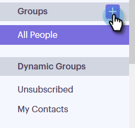

# Gruppen verwalten {#manage-groups}

Erfahren Sie, wie Sie Ihre Gruppen in Sales Connect verwalten.

## Erstellen einer Gruppe {#create-a-group}

1. Klicken Sie auf der Seite &quot;Personen&quot;auf das Pluszeichen &quot;**+**&quot;neben Gruppen.

   

1. Benennen Sie Ihre Gruppe und klicken Sie auf **Erstellen**.

   

   Das ist es!

## Kontakte zu einer Gruppe hinzufügen {#add-contacts-to-a-group}

1. Suchen und wählen Sie auf der Seite Personen die Gruppe aus, der Sie Personen hinzufügen möchten.

   

1. Klicken Sie auf **Gruppenaktionen** und wählen Sie **Kontakt erstellen**.

   

   >[!NOTE]
   >
   >Dadurch wird jeweils ein Kontakt hinzugefügt. Um mehrere Kontakte gleichzeitig hinzuzufügen, führen Sie [diese Schritte](/help/marketo/product-docs/marketo-sales-connect/people/managing-contacts/import-contacts-via-csv.md) aus.

1. Füllen Sie die Kontaktinformationen aus und klicken Sie auf **Erstellen** (oder auf **Erstellen und Hinzufügen von Neu** , um einen weiteren hinzuzufügen).

   

   Und du bist fertig!

   >[!NOTE]
   >
   >Möglicherweise müssen Sie die Schaltfläche &quot;Aktualisieren&quot;drücken, um neue Kontakte zu sehen.

## Freigeben von Gruppen {#share-a-group}

1. Suchen und wählen Sie auf der Seite Personen die Gruppe aus, die Sie freigeben möchten.

   

1. Klicken Sie auf das Feld (drei vertikale Punkte) und wählen Sie **Freigabe** aus.

   

1. Klicken Sie auf das Dropdown-Menü und wählen Sie das Team aus, für das Sie die Gruppe freigeben möchten.

   

1. Klicken Sie auf **Freigabe**.

   

   Sie sind weiterhin der Eigentümer der Gruppe, aber sie wird jetzt unter &quot;Team Groups&quot;angezeigt.

## Aufheben der Freigabe einer Gruppe {#unshare-a-group}

1. Suchen und wählen Sie auf der Seite Personen die Gruppe aus, deren Freigabe Sie aufheben möchten.

   

1. Klicken Sie auf das Feld (drei vertikale Punkte) und wählen Sie **Freigabe** aus.

   

1. Klicken Sie auf das **X** neben dem Team, für das Sie die Gruppe freigegeben haben, und klicken Sie dann aus dem Modal heraus.

   

   Die Gruppenfreigabe ist jetzt aufgehoben.

## Eine Gruppe umbenennen {#rename-a-group}

1. Suchen und wählen Sie auf der Seite Personen die Gruppe aus, die Sie umbenennen möchten.

   

1. Klicken Sie auf das Feld (drei vertikale Punkte) und wählen Sie **Umbenennen** aus.

   

1. Geben Sie den neuen Namen ein und drücken Sie die Eingabetaste.

   

## Eine Gruppe löschen {#delete-a-group}

1. Suchen und wählen Sie auf der Seite Personen die Gruppe aus, die Sie löschen möchten.

   

1. Klicken Sie auf das Feld (drei vertikale Punkte) und wählen Sie **Löschen** aus.

   

1. Klicken Sie zur Bestätigung auf **Löschen** .

   
