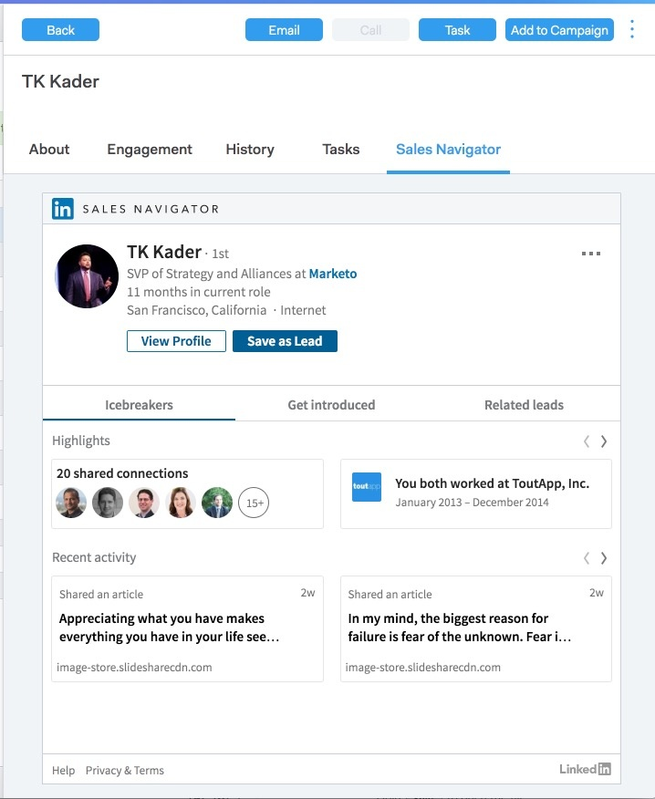

# Person Detail-Ansicht {#person-detail-view}

Die Ansicht der Personendetails bietet ein detailliertes Profil der einzelnen Personen in Ihrem MSC-Konto.

## Zugriff auf {#how-to-access}

1. Klicken Sie auf die Registerkarte **Personen**, um auf die Ansicht der Personendetails zuzugreifen.

   

1. Klicken Sie auf die gewünschte Person.

   

   >[!TIP]
   >
   >Ganz egal, wo man den Namen einer Person sieht, man kann darauf klicken und zu ihrer Ansicht &quot;Personendetails&quot;gelangen.

## Info zu Registerkarte {#about-tab}

Umfasst alle Kontaktangaben der Person.

**Kontaktkarte**

* Enthält Kontaktinformationen wie: E-Mail-Adresse, Name, Firma, Titel, Telefonnummer und Links zu sozialen Medien

**Gruppen**

* Zeigt an und verwaltet, welche Gruppen diese Person angehört

**Kontoinformationen**

* Kann eine Person zu Salesforce hinzufügen
* Ziehen Sie Konto- und Kontakt-Informationen von Salesforce ab

**Benutzerdefinierte Felder**

* Benutzerdefinierte Felder Hinzufügen oder entfernen, die als dynamische Felder in Ihren Vorlagen und Kampagnen verwendet werden können

**Hinweise**

* Erstellen benutzerdefinierter Notizen

## Interaktionsregister {#engagement-tab}

Sehen Sie, wie diese Person sich mit Ihrer Reichweite beschäftigt.

**Sales Connect-Aktivität**

* Siehe Interaktions-Aktivitäten aus Ihren Verkaufs-E-Mails und Kampagnen

**Marketing-Aktivität**

* Erkennen Sie, wie Ihre Person mit Marketing-Kampagnen interagiert

## Verlauf, Registerkarte {#history-tab}

Zeigt Ihre Reichweitengeschichte. Umfasst E-Mails, Kampagnen und Anrufe.

**Kampagnen**

* Aktive oder abgeschlossene Kampagnen, denen diese Person angehört

**Marketing-Kampagnen**

* Sehen Sie sich alle Marketing-Kampagnen an, zu denen diese Person gehört

**E-Mails zum Vertrieb**

* Alle E-Mails anzeigen, die Sie an diese Person gesendet haben, und die Einsatzmetriken

**Verkaufsaufrufe**

* Alle Anrufe sehen, die Sie an diese Person gerichtet haben

## Registerkarte Aufgaben {#tasks-tab}

Verwalten Sie Aufgaben, die dieser Person zugeordnet sind.

Aktionen, die Sie ausführen können:

* Bearbeiten oder Löschen einer Aufgabe
* Siehe Fälligkeitsdatum
* Klicken Sie auf den Typ, um das Verkaufstelefon bei Aufruf, E-Mail erstellen bei E-Mail, LinkedIn bei E-Mail und Benutzerspezifische Notiz bei Benutzerdefiniert zu starten.
* Aufgabe als abgeschlossen markieren

## Registerkarte &quot;Sales Navigator&quot; {#sales-navigator-tab}

Ansicht von LinkedIn-Profil-Daten mit LinkedIn-Verkaufs-Navigator.

>[!NOTE]
>
>Sales Navigator ist ein kostenpflichtiges Add-on über LinkedIn. Wenden Sie sich an den jeweiligen Anbieter, um diese Funktion zu erhalten.

Erwähnen Sie Eisbrecher, um einen Bericht zu erstellen.

Speichern Sie Kontakte als Interessenten im Sales Navigator.
