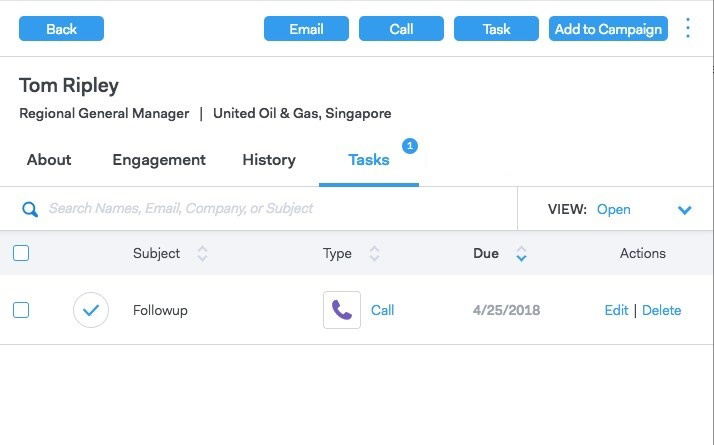

# Ansicht „Personendetails“ {#person-detail-view}

Die Personendetailansicht bietet ein detailliertes Profil jeder Person in Ihrem MSC-Konto.

## So greifen Sie darauf zu {#how-to-access}

1. Um auf die Personendetailansicht zuzugreifen, klicken Sie auf die Registerkarte **[!UICONTROL Personen]**.

   

1. Klicken Sie auf die gewünschte Person.

   

   >[!TIP]
   >
   >Fast überall, wo Sie den Namen einer Person sehen, können Sie darauf klicken und zu ihrer Personendetailansicht gelangen.

## Registerkarte „Info“ {#about-tab}

Enthält alle Kontaktinformationen der Person.

**Kontaktkarte**

* Enthält Kontaktinformationen wie: E-Mail-Adresse, Name, Firma, Titel, Telefonnummer und Social-Media-Links

**Gruppen**

* Zeigt an und verwaltet, zu welchen Gruppen diese Person gehört

**Kontoinformationen**

* Kann eine Person zu [!DNL Salesforce] hinzufügen
* Konto- und Lead-/Kontaktinformationen aus [!DNL Salesforce] abrufen

**Benutzerdefinierte Felder**

* Hinzufügen oder Entfernen von benutzerdefinierten Feldern, die als dynamische Felder in Ihren Vorlagen und Kampagnen verwendet werden können

**Hinweise**

* Erstellen benutzerdefinierter Notizen

## Registerkarte „Interaktion“ {#engagement-tab}

Erfahren Sie, wie diese Person mit Ihrer Kontaktaufnahme interagiert.

**Sales Connect-Aktivität**

* Interaktionsaktivitäten in Ihren Verkaufs-E-Mails und -Kampagnen anzeigen

**Marketing-Aktivität**

* Erfahren Sie, wie Ihre Person mit Marketing-Kampagnen interagiert

## Registerkarte „Verlauf“ {#history-tab}

Zeigt den Verlauf der Kontakte an. Enthält E-Mails, Kampagnen und Aufrufe.

**[!UICONTROL Verkaufskampagnen]**

* Anzeigen aller aktiven oder abgeschlossenen Kampagnen, zu denen diese Person gehört

**[!UICONTROL Marketing-Kampagnen]**

* Anzeigen aller Marketing-Kampagnen, in denen diese Person Mitglied ist

**[!UICONTROL E-Mails]**

* Zeigen Sie alle E-Mails an, die Sie dieser Person gesendet haben, und die Interaktionsmetriken

**[!UICONTROL Verkaufsanrufe]**

* Alle Aufrufe anzeigen, die Sie an diese Person getätigt haben

## Registerkarte „Aufgaben“ {#tasks-tab}

Aufgaben verwalten, die mit dieser Person verknüpft sind.

Aktionen, die Sie ausführen können:

* Aufgabe bearbeiten oder löschen
* Fälligkeitsdatum anzeigen
* Klicken Sie auf den Typ, um den Verkauf per Telefon zu starten, wenn Sie anrufen, auf E-Mail erstellen, auf LinkedIn, wenn Sie inMail sind, und auf Benutzerdefinierte Notiz, wenn sie benutzerdefiniert ist.
* Markieren einer Aufgabe als abgeschlossen
