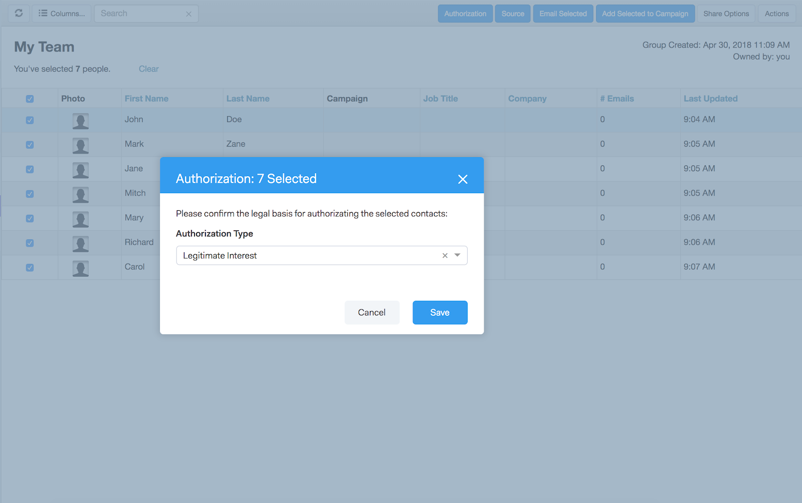

# Sales Connect und GDPR Compliance {#sales-connect-and-gdpr-compliance}

Die Datenschutzverordnung (GDPR) ist eine Rechtsvorschrift der Europäischen Vereinigung, die am 25. Mai 2018 in Kraft getreten ist.

## Übersicht {#overview}

Ziel ist es, die Rechte der betroffenen Personen innerhalb der Europäischen Vereinigung (EU) und des Europäischen Wirtschaftsraums (EWR) hinsichtlich der Nutzung und des Schutzes ihrer personenbezogenen Daten zu stärken. &quot;personenbezogene Daten&quot;sind Informationen, die sich auf eine bestimmte oder bestimmbare natürliche Person beziehen.

Der GDPR basiert auf sechs Grundsätzen (wie in Artikel 5 der Rechtsvorschriften beschrieben):

1. Transparenz darüber, wie Daten verwendet werden und wofür sie verwendet werden.
1. Sicherstellen, dass die erfassten Daten nur für die zum Zeitpunkt der Erfassung ausdrücklich angegebenen Zwecke verwendet werden.
1. Beschränkung der Datenerfassung auf das zur Erfüllung des Zwecks, zu dem sie erhoben wird, erforderliche Maß.
1. Sicherstellen der Genauigkeit der Daten.
1. Speichern der Daten nur so lange, wie dies innerhalb des vorgesehenen Zwecks erforderlich ist.
1. Vermeidung der unbefugten Verwendung oder des versehentlichen Verlustes der Daten durch Einsatz geeigneter Sicherheitsmaßnahmen.

Darüber hinaus gibt es eine neue Verpflichtung zur Rechenschaftspflicht, um nachweisen zu können, wie die Einhaltung der Vorschriften verwaltet und verfolgt wird. Dies bedeutet, dass Aufzeichnungen darüber geführt werden müssen, wie und warum personenbezogene Daten erhoben wurden, sowie die Dokumentation der zum Schutz dieser Daten eingerichteten Verfahren.

## Auf wen findet sie Anwendung? {#to-whom-does-it-apply}

Der GDPR gilt für alle Organisationen innerhalb oder außerhalb der EU, die Waren oder Dienstleistungen für betroffene Personen innerhalb der EU und des EWR vermarkten und/oder deren Verhalten verfolgen. Wenn Sie mit Betroffenen in Europa Geschäfte machen, die mit der Verarbeitung ihrer personenbezogenen Daten verbunden sind, gilt diese Gesetzgebung für Sie. Die Sanktionen wegen Nichteinhaltung der Vorschriften sind erheblich, und es werden hohe Geldbußen für Verstöße gegen die Verordnung verhängt; die Höchststrafe für eine einzelne Verletzung beträgt 20 Mio. € oder 4 % des weltweiten Jahresumsatzes, je nachdem, welcher Wert höher ist.

## Auswirkungen auf Marketing {#implications-for-marketing}

Marketingexperten wollen Kundenerlebnisse schaffen, die sich persönlich und menschlich fühlen, auf Vertrauen gegründet und mit Sorgfalt bereitgestellt werden. Obwohl der GDPR diese Bedingungen nicht verwendet, verfolgen wir dieselben Ziele - die Rechte der Kunden zu respektieren und ihr Vertrauen zu gewinnen. Um dieses Vertrauen aufzubauen und aufrechtzuerhalten, müssen Marketingmitarbeiter darauf geachtet werden, wie, wann und warum ihre Kunden eingebunden werden möchten. Es ist wichtig, dass Kundenpräferenzen respektiert werden, nicht nur als gesetzliche Voraussetzung, sondern als Grundlage für kundenorientierte Einsatzpraktiken.

Entscheidend ist, wie Marketingfachleute diese höheren Erwartungen bei der Erfassung, Verwendung und Sicherheit der personenbezogenen Daten, die routinemäßig im Zuge ihrer Arbeit verwendet werden, angehen, und Marketo kann dabei helfen, diese Erwartungen zu erfüllen.\
Es gibt zwei wichtige Aspekte des GDPR, bei denen Marketingexperten vergangene, aktuelle und künftige Vorgehensweisen überprüfen müssen. Die erste ist die Einwilligung des Individuums zur Verarbeitung seiner personenbezogenen Daten, und die zweite ist die Rechenschaftspflicht, d.h. die Fähigkeit, nachzuweisen, wie die Grundsätze des GDPR befolgt werden.

Wir bieten ausführliche Informationen über die Einwilligung und Rechenschaftspflicht innerhalb der Marketing-Plattform in unserem E-Book, [GDPR und The Marketer](http://www.marketo.com/ebooks/the-gdpr-and-the-marketer/). In diesem Artikel konzentrieren wir uns jedoch speziell auf die neuen Funktionen in Marketo Sales Connect, die Ihrem Unternehmen helfen werden, die GDPR-Regeln einzuhalten.

## GDPR-Konformität mit Marketo Sales Connect {#gdpr-compliance-in-marketo-sales-connect}

Marketo Sales Connect ist eine leistungsstarke Anwendung - Teil der Marketing-Interaktionsplattform -, die einen einzigen Arbeitsablauf und eine einheitliche Ansicht für Vertrieb und Marketing bietet, um die Pipeline durch kollaboratives Engagement gemeinsam schneller voranzutreiben. Neue Funktionen in Marketo Sales Connect wurden speziell unter Berücksichtigung der GDPR-Compliance entwickelt. Wir werden alle drei Funktionen erläutern und erklären, wie sie bei ordnungsgemäßer Verwendung zur Einhaltung der GDPR in Ihrem Unternehmen beitragen.

## Kompatibilitätskarte {#compliance-card}

Marketo Sales Connect enthält eine Compliance Card in der Ansicht &quot;Personendaten&quot;, mit der wichtige Informationen zum Autorisierungstyp eines Kontakts sowie zum Quelltyp bereitgestellt werden. Auf diese Weise können Benutzer Informationen, die für den Datenschutz von entscheidender Bedeutung sind, einfach hinzufügen und nachverfolgen und fundiertere Entscheidungen zur Kampagne-/Informationsstrategie treffen.

Autorisierungstyp kontaktieren

Innerhalb der Compliance Card können Benutzer die Rechtsgrundlage für die Verarbeitung der persönlichen Daten eines Kontakts über die Dropdownliste &quot;Genehmigung&quot;nachverfolgen. Die Kenntnis des Autorisierungstyps eines Kontakts hilft Marketo Sales Connect-Benutzern, fundiertere Entscheidungen in Bezug auf die Kontaktverfahren zu treffen, und stellt sicher, dass jede Kampagne oder jeder Einsatz rechtmäßig und angemessen ist.

Die Benutzer haben eine Vielzahl von Optionen zur Auswahl, darunter:

* Zustimmung
* Rechtliches Interesse
* Ausführung eines Vertrags
* Einhaltung gesetzlicher Verpflichtungen
* Schutz lebenswichtiger Interessen
* Öffentliches Interesse/Amtliche Behörde
* Sonstiges

Kontaktquellentyp

Innerhalb der neuen Compliance Card können Benutzer die Quelle eines Kontakts nachverfolgen. Der Quelltyp definiert, woher die Informationen eines Kontakts kamen, als sie zum ersten Mal in Marketing to Sales Connect hochgeladen wurden. Die Kenntnis des Quellentyps eines Kontakts hilft auch bei Entscheidungen über die Informationspraxis, sowie bei der Bestimmung, welche anderen Systeme oder Orte personenbezogene Daten gespeichert werden, und gewährleistet, dass jede Interaktion mit den GDPR-Vorschriften im Einklang steht.

Auch hier stehen den Benutzern zahlreiche Dropdown-Optionen zur Auswahl, darunter:

* CRM-Synchronisierung
* Importieren
* Manuelles Hochladen
* Chrome Extension
* Sonstiges

Bearbeiten der Kompatibilitätskarte

Wenn die Ansicht &quot;Personendetails&quot;geöffnet ist, klicken Sie in der Einhaltungskarte auf **Bearbeiten**.

Es werden zwei Dropdown-Listen angezeigt: Autorisierungstyp und Quelltyp.

Wenn Sie &quot;Zustimmung&quot;als Autorisierungstyp auswählen, sind zwei Felder obligatorisch: &quot;Datum der Zustimmung&quot;und &quot;Zweck der Verarbeitung&quot;werden angezeigt. Diese beiden Felder gelten nicht für andere Optionen.

Wenn &quot;Sonstige&quot;für &quot;Autorisierungstyp&quot;oder &quot;Quelltyp&quot;ausgewählt ist, können Sie Text eingeben, um den Quelltyp zu beschreiben.
** 

Massenaktionen** Marketing-Verkaufsstelle ermöglicht auch die stapelweise Aktualisierung der Autorisierungs- und Quelltypen eines Kontakts, wodurch wertvolle Zeit im Compliance-Prozess eingespart wird.

Wenn Sie auf der Seite &quot;Personen&quot;einen oder mehrere Kontakte auswählen, werden die Schaltflächen &quot;Autorisierung&quot;und &quot;Quelle&quot;oben im Container angezeigt. Mithilfe dieser Schaltflächen können Sie die Autorisierung oder Quelle mehrerer Kontakte gleichzeitig festlegen.

Wenn Sie auf das Genehmigungsmodell klicken, wird ein Popup mit Dropdown-Optionen angezeigt, die mit den Optionen in der Einhaltungskarte übereinstimmen.

Nach der Aktualisierung des Autorisierungstyps erhalten Sie ein Popup-Fenster mit einer Bestätigung, in dem Sie die aktualisierten Informationen in der Einhaltungskarte in der Ansicht &quot;Personendetails&quot;sehen können.

Gleichermaßen kann der Quelltyp auch stapelweise aktualisiert werden, indem auf das Modal Quelle geklickt wird.

Nach Auswahl des richtigen Quelltyps für die ausgewählten Kontakte wird ein Bestätigungsfenster angezeigt, um die erfolgreiche Aktualisierung zu bestätigen.

## Exportieren von Kontaktdaten von Marketing zu Sales Connect {#exporting-contact-data-from-marketo-sales-connect}

Sie haben die Möglichkeit, Kontaktinformationen aus der Ansicht &quot;Personendetails&quot;zu exportieren. Beim Exportieren wird eine .CSV-Datei mit den folgenden Spalten heruntergeladen:

<table> 
 <colgroup> 
  <col> 
  <col> 
  <col> 
 </colgroup> 
 <tbody> 
  <tr> 
   <td>Vorname</td> 
   <td>Webseite</td> 
   <td>Facebook</td> 
  </tr> 
  <tr> 
   <td>Nachname</td> 
   <td>Sonstiges</td> 
   <td>Twitter</td> 
  </tr> 
  <tr> 
   <td>Firma</td> 
   <td>Aktualisiert am</td> 
   <td>LinkedIn</td> 
  </tr> 
  <tr> 
   <td>Titel</td> 
   <td>Erstellt am</td> 
   <td>Exportiert am</td> 
  </tr> 
  <tr> 
   <td>Email-ID</td> 
   <td>Salesforce-ID</td> 
   <td> </td> 
  </tr> 
  <tr> 
   <td>Telefonnummer</td> 
   <td>Person-ID</td> 
   <td> </td> 
  </tr> 
 </tbody> 
</table>

>[!NOTE]
>
>Dies kann nur einmal pro Kontakt erfolgen. Es gibt derzeit keine Funktion, die Massenexporte von Kontakten erlaubt.

Um Kontaktinformationen zu exportieren, klicken Sie auf die drei vertikalen Punkte in der Kopfzeile der Ansicht &quot;Personendetails&quot;und wählen Sie **Export**. Die .CSV-Datei wird automatisch heruntergeladen.   

>[!NOTE]
>
>Der GDPR erfordert auch die Möglichkeit, Kontakte aus der Benutzeroberfläche zu löschen, aber Marketo Sales Connect verfügt bereits über diese Funktion.

## Abmeldet {#unsubscribes}

Ein häufig missverständlicher Bereich des GDPR umfasst Kontakte, die sich von der Datenbank des Unternehmens abmelden. Um neue Regeln zum Schutz der Daten derjenigen einzuhalten, die sich abmelden möchten, wurde die folgende Funktion in Marketing Sales Connect integriert:

**Abmelden-Links:** Abmelden-Links werden automatisch an alle E-Mails angehängt, die von der Sales Connect-Webanwendung gesendet werden, um sicherzustellen, dass Kontakte eine Möglichkeit erhalten, sich abzumelden.\
**Synchronisierung abmelden:** Benutzer können Abmeldeabbrüche mit und von ihrem CRM (Salesforce) synchronisieren, um sicherzustellen, dass die Abmeldeabmeldung aktuell ist.\
**Verlauf der Abmeldung:** Benutzer können historische Ausschluss- und Anmeldevorgänge in der Ansicht &quot;Personendaten&quot;sehen.\
**Entfernen des Abonnements abbestellen: Wenn Sie einen nicht abonnierten Kontakt wieder** wählen, muss der Benutzer über Administratorrechte verfügen und nachweisen, dass der Kontakt seine neue Einwilligung gegeben hat, ihn zu kontaktieren.

## Zukünftige Updates {#future-updates}

Als begeisterter Verfechter der Macht und Kundenorientierung der Interaktionswirtschaft versteht Marketo, wie wichtig es ist, Privatsphäre und Datenschutz in die Hände der betroffenen Person zu legen. Wie bei anderen Datenschutzgesetzen erfordert die Einhaltung der AGB sowohl von Marketo als auch von unseren Kunden Engagement. Dieser Artikel soll Ihnen bei der Verwendung von Marketo behilflich sein, um die GDPR-Konformität Ihres Unternehmens zu unterstützen.

Wir werden weiterhin die geltenden Leitlinien der Regulierungsbehörden für das BIP und damit zusammenhängende Rechtsvorschriften genau verfolgen. Aktualisierungen werden in unserem Trust Center unter [trust.marketo.com](http://trust.marketo.com) veröffentlicht.
