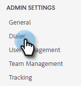
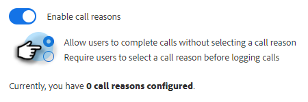

# Gründe für Aufrufe {#call-reasons}

Lassen Sie zu, dass Ihre Verkaufsteams bei Aufrufen die Anrufgründe auswählen, damit Ihr Team die Gründe für Aufrufe verstehen kann.

>[!NOTE]
>
>**Administratorberechtigungen erforderlich.**

## Gründe für Anrufe aktivieren {#enable-call-reasons}

1. Klicken Sie auf das Zahnradsymbol und wählen Sie **Einstellungen**.

   

1. Wählen Sie unter &quot;Admin Settings&quot;die Option **Dialer**.

   

1. Auswählen **Gründe für Anrufe aktivieren**.

   

1. Wählen Sie die gewünschte Anrufgrundanforderung aus.

   

## Grund für Aufruf erstellen {#create-call}

1. Klicken Sie auf das Zahnradsymbol und wählen Sie **Einstellungen**.

   

1. Wählen Sie unter &quot;Admin Settings&quot;die Option **Dialer**.

   

1. Klicken **Gründe für Aufrufe verwalten**.

   

1. Geben Sie den Namen des gewünschten Anrufgrunds in das Textfeld ein und klicken Sie auf **Hinzufügen**.

   

## Anrufgrund auswählen {#select-a-call-reason}

Nachdem die Anrufgründe aktiviert wurden. Benutzer können beim Aufruf eine auswählen.

1. Klicken Sie auf die Anruftaste, um den Dialer zu starten.

   

1. Geben Sie die Anrufinformationen im Dialer ein.

   

1. Klicken Sie auf Aufruf.

   

1. Wählen Sie den Anrufgrund aus, der den Aufruf am besten beschreibt.

   

1. Beenden Sie den Aufruf.

   

1. Protokollieren Sie den -Aufruf.

   

>[!MORELIKETHIS]
>
>* [Gründe für Protokollaufrufe und Ergebnisse von Aufrufen an Salesforce](/help/marketo/product-docs/marketo-sales-connect/phone/log-call-reasons-and-call-outcomes-to-salesforce.md)
>* [Ergebnisse der Aufrufe](/help/marketo/product-docs/marketo-sales-connect/phone/call-outcomes.md)

