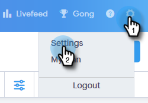

# Anrufaufzeichnung aktivieren {#enable-call-recording}

Als Administrator können Sie die Anrufaufzeichnung für Ihre [!DNL Sales Connect]-Anrufe aktivieren. Die Anrufe Ihres Teams aufzunehmen kann eine gute Möglichkeit sein, Ihre Vertriebsmitarbeiter über die Best Practices für Anrufe zu informieren.

1. Klicken Sie auf das Symbol Einstellungen und wählen Sie **[!UICONTROL Einstellungen]** aus.

   

1. Klicken [!UICONTROL &#x200B; unter &quot;]&quot; auf **[!UICONTROL Allgemein]**.

   

1. Scrollen Sie nach unten zu [!DNL Sales Connect] Telefoneinstellungen und wählen Sie den **[!UICONTROL Anrufaufzeichnung aktivieren]** aus.

   

1. Wenn Sie Ihren Verkäufern die Möglichkeit geben möchten, die Anrufaufzeichnung für sich selbst zu aktivieren oder zu deaktivieren, klicken Sie auf **[!UICONTROL Optionale Aufzeichnung für alle Team-Mitglieder]**. Wenn alle Anrufe automatisch aufgezeichnet werden sollen, klicken Sie auf **[!UICONTROL Alle Anrufe aufzeichnen]**.

   

>[!MORELIKETHIS]
>
>[Zwei-Parteien-Einverständniseinstellungen](/help/marketo/product-docs/marketo-sales-connect/phone/two-party-consent-settings.md)
