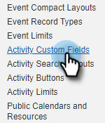
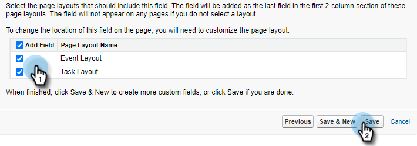

# Gründe für Protokollaufrufe und Ergebnisse von Aufrufen an Salesforce {#log-call-reasons-and-call-outcomes-to-salesforce}

Wenn Sie Aufrufergebnisse protokollieren und Salesforce aus Berichts- oder Sichtbarkeitsgründen aufrufen möchten, können Sie für jede Aktivität ein eigenes Aktivitätsfeld erstellen. Jedes Feld muss einen bestimmten API-Namen verwenden (in Salesforce als &quot;Feldname&quot;bezeichnet).

* Feldname für Aufrufergebnisse: mktosales_call_result
* Feldname für Aufrufgründe: mktosales_call_reason

Um diese Felder zu nutzen, müssen Sie zunächst das Feld als ein benutzerdefiniertes Aktivitätsfeld erstellen. Damit sie für Benutzer sichtbar ist, müssen Sie sie dem Seitenlayout der Aufgabenobjekte hinzufügen.

## Salesforce Classic {#salesforce-classic}

### Benutzerdefiniertes Aktivitätsfeld in Salesforce Classic erstellen  {#create-custom-activity-field-in-salesforce-classic}

1. Klicken Sie in Salesforce auf **Einrichtung**.

   

1. Geben Sie &quot;Aktivitäten&quot;in das Feld Schnellsuche ein.

   

1. Klicken Sie auf **Benutzerdefinierte Aktivitätsfelder**.

   

1. Klicken Sie auf **Neu**.

   

1. Wählen Sie den Datentyp &quot;Text&quot;aus und klicken Sie auf **Weiter**.

   

1. Geben Sie dem benutzerdefinierten Feld den oben definierten Feldnamen. Die Feldlänge ist auf 255 Zeichen begrenzt. Feldbezeichnung ist das für Ihr Verkaufsteam sichtbare Feld und kann an die Anforderungen Ihres Teams angepasst werden.

   

1. Die übrigen Einstellungen sind optional. Klicken Sie nach Abschluss der Konfiguration auf **Weiter**.

   

1. Wählen Sie die gewünschten Sicherheitseinstellungen auf Feldebene für dieses Feld aus und klicken Sie auf **Weiter** (das folgende Bild ist nur ein Beispiel).

   

   >[!NOTE]
   >
   >Vergewissern Sie sich, dass das benutzerdefinierte Feld für das Profil, das Ihre Sales Connect-Benutzer verwenden, sowie für alle anderen Felder, die Sie sehen möchten, sichtbar ist.

1. Wählen Sie die Seitenlayouts aus, denen das Feld hinzugefügt werden soll, und klicken Sie auf &quot;**Speichern**&quot;. (Optional können Sie auf &quot;**Speichern und Neu**&quot;klicken und den Prozess für das Feld &quot;Aufrufgrund&quot;wiederholen.)

   

### Fügen Sie benutzerdefinierte Aktivitätsfelder zum Aufgabenseitenlayout in Salesforce Classic hinzu. {#add-custom-activity-field-to-task-page-layout-in-salesforce-classic}

>[!NOTE]
>
>Sie müssen diese Schritte nur ausführen, wenn Sie Ihr gewünschtes Seitenlayout in Schritt 9 oben nicht ausgewählt haben.

1. Klicken Sie in Salesforce auf **Einrichtung**.

   

1. Geben Sie &quot;Aufgabe&quot;in das Feld Schnellsuche ein.

   

1. Klicken Sie auf **Aufgabenseitenlayouts**.

   

1. Klicken Sie neben dem Aufgabenseitenlayout, dem Sie dieses Feld hinzufügen möchten, auf **Bearbeiten** .

   

1. Ziehen Sie das Feld in den gewünschten Bereich des Aufgabenseitenlayouts.

   

1. Klicken Sie auf **Speichern**.

   

## Salesforce Lightning {#salesforce-lightning}

### Benutzerdefiniertes Aktivitätsfeld in Salesforce-Blitzen erstellen {#create-custom-activity-field-in-salesforce-lightning}

1. Klicken Sie in Salesforce auf das Zahnradsymbol oben rechts und wählen Sie **Einrichtung** aus.

   

1. Klicken Sie auf **Objekt-Manager**.

   

1. Geben Sie &quot;Aktivität&quot;in das Feld Schnellsuche ein.

   

1. Klicken Sie auf die Bezeichnung **Aktivität** .

   

1. Klicken Sie auf **Felder und Beziehungen**.

   

1. Klicken Sie auf **Neu**.

   

### Fügen Sie benutzerdefiniertes Aktivitätsfeld zum Aufgabenseitenlayout in Salesforce-Blitzen hinzu {#add-custom-activity-field-to-task-page-layout-in-salesforce-lightning}

1. Klicken Sie in Salesforce auf das Zahnradsymbol oben rechts und wählen Sie **Einrichtung** aus.

   

1. Klicken Sie auf **Objekt-Manager**.

   

1. Geben Sie &quot;Aufgabe&quot;in das Feld Schnellsuche ein.

   

1. Klicken Sie auf die Bezeichnung **Aufgabe** .

   

1. Klicken Sie auf **Seiten-Layouts**.

   

1. Klicken Sie auf das Aufgabenseitenlayout, dem Sie dieses Feld hinzufügen möchten.

   

1. Ziehen Sie das Feld in den gewünschten Bereich des Aufgabenseitenlayouts.

   

1. Klicken Sie auf **Speichern**.

   

>[!MORELIKETHIS]
>
>[Install Sales Connect Event Fields on Activity History](/help/marketo/product-docs/marketo-sales-connect/crm/salesforce-customization/install-sales-connect-event-fields-on-activity-history.md)
