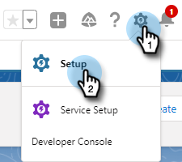

# Gründe und Anrufergebnisse bei [!DNL Salesforce] protokollieren {#log-call-reasons-and-call-outcomes-to-salesforce}

Wenn Sie Anrufergebnisse und Anrufgründe für [!DNL Salesforce] zu Berichts- oder Sichtbarkeitszwecken protokollieren möchten, können Sie für jede Aktivität ein benutzerdefiniertes Feld erstellen. Jedes Feld muss einen bestimmten API-Namen verwenden (in [!DNL Salesforce] als „Feldname“ bezeichnet).

* Feldname für Anrufergebnisse: motosales_call_result
* Feldname für Anrufgründe: motosales_call_reason

Um diese Felder zu verwenden, müssen Sie das Feld zunächst als benutzerdefiniertes Aktivitätsfeld erstellen. Um sie für Benutzer sichtbar zu machen, müssen Sie sie zum Aufgabenobjekt-Seiten-Layout hinzufügen.

## [!DNL Salesforce] Classic {#salesforce-classic}

### Erstellen eines benutzerdefinierten Aktivitätsfelds in [!DNL Salesforce] Classic  {#create-custom-activity-field-in-salesforce-classic}

1. Klicken Sie [!DNL Salesforce] auf **[!UICONTROL Setup]**.

   

1. Geben Sie „Aktivitäten“ in das Feld „Schnellsuche“ ein.

   

1. Klicken Sie auf **[!UICONTROL Aktivität Benutzerdefinierte Felder]**.

   

1. Klicken Sie auf **[!UICONTROL Neu]**.

   

1. Wählen Sie den Datentyp &quot;[!UICONTROL Text] und klicken Sie auf **[!UICONTROL Weiter]**.

   

1. Geben Sie dem benutzerdefinierten Feld den Feldnamen wie oben definiert. Die Feldlänge ist auf 255 Zeichen begrenzt. Die Feldbezeichnung ist das Feld, das für Ihr Vertriebsteam sichtbar ist, und kann an die Anforderungen Ihres Teams angepasst werden.

   

1. Die übrigen Einstellungen sind optional. Klicken Sie nach Abschluss der Konfiguration auf **[!UICONTROL Weiter]**.

   

1. Wählen Sie die gewünschten Sicherheitseinstellungen auf Feldebene für dieses Feld aus und klicken Sie auf **[!UICONTROL Weiter]** (die Abbildung unten ist nur ein Beispiel).

   

   >[!NOTE]
   >
   >Stellen Sie sicher, dass das benutzerdefinierte Feld für das Profil sichtbar ist, das Ihre [!DNL Sales Connect] verwenden, zusammen mit überall dort, wo es sichtbar sein soll.

1. Wählen Sie aus, welchen Seiten-Layouts das Feld hinzugefügt werden soll, und klicken Sie auf **[!UICONTROL Speichern]** (optional können Sie auf **[!UICONTROL Speichern und neu]** klicken und den Vorgang für das Feld Anrufgrund wiederholen).

   

### Hinzufügen eines benutzerdefinierten Aktivitätsfelds zum Aufgabenseiten-Layout in [!DNL Salesforce] Classic {#add-custom-activity-field-to-task-page-layout-in-salesforce-classic}

>[!NOTE]
>
>Sie müssen diese Schritte nur ausführen, wenn Sie das gewünschte Seiten-Layout in Schritt 9 oben nicht ausgewählt haben.

1. Klicken Sie [!DNL Salesforce] auf **[!UICONTROL Setup]**.

   

1. Geben Sie „Aufgabe“ in das Feld „Schnellsuche“ ein.

   

1. Klicken Sie **[!UICONTROL Aufgabenseiten-Layouts]**.

   

1. Klicken Sie **[!UICONTROL Bearbeiten]** neben dem Aufgabenseiten-Layout, dem Sie dieses Feld hinzufügen möchten.

   

1. Ziehen Sie das Feld per Drag-and-Drop in den gewünschten Bereich des Aufgabenseiten-Layouts.

   

1. Klicken Sie auf **[!UICONTROL Speichern]**.

   

## [!DNL Salesforce] Blitz {#salesforce-lightning}

### Benutzerdefiniertes Aktivitätsfeld in [!DNL Salesforce] Lightning erstellen {#create-custom-activity-field-in-salesforce-lightning}

1. Klicken Sie [!DNL Salesforce] oben rechts auf das Zahnradsymbol und dann auf **[!UICONTROL Setup]**.

   

1. Klicken Sie auf **[!UICONTROL Objekt-Manager]**.

   

1. Geben Sie [!UICONTROL Aktivität] in das Feld Schnellsuche ein.

   

1. Klicken Sie auf die **[!UICONTROL Aktivität]** Bezeichnung.

   

1. Klicken Sie **[!UICONTROL Felder und Beziehungen]**.

   

1. Klicken Sie auf **[!UICONTROL Neu]**.

   

### Benutzerdefiniertes Aktivitätsfeld zum Aufgabenseiten-Layout in [!DNL Salesforce] Lightning hinzufügen {#add-custom-activity-field-to-task-page-layout-in-salesforce-lightning}

1. Klicken Sie [!DNL Salesforce] oben rechts auf das Zahnradsymbol und dann auf **[!UICONTROL Setup]**.

   

1. Klicken Sie auf **[!UICONTROL Objekt-Manager]**.

   

1. Geben Sie [!UICONTROL Aufgabe] in das Feld Schnellsuche ein.

   

1. Klicken Sie auf die **[!UICONTROL Aufgabe]** Bezeichnung.

   

1. Klicken Sie auf **[!UICONTROL Seiten-Layouts]**.

   

1. Klicken Sie auf das Aufgabenseiten-Layout, dem Sie dieses Feld hinzufügen möchten.

   

1. Ziehen Sie das Feld per Drag-and-Drop in den gewünschten Bereich des Aufgabenseiten-Layouts.

   

1. Klicken Sie auf **[!UICONTROL Speichern]**.

   

>[!MORELIKETHIS]
>
>[Installieren von Sales Connect-Ereignisfeldern im Aktivitätsverlauf](/help/marketo/product-docs/marketo-sales-connect/crm/salesforce-customization/install-sales-connect-event-fields-on-activity-history.md)
