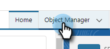
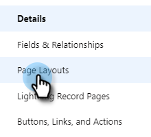
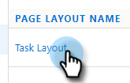

# Gründe und Anrufergebnisse bei Salesforce protokollieren {#log-call-reasons-and-call-outcomes-to-salesforce}

Wenn Sie Anrufergebnisse und Anrufgründe zu Berichts- oder Sichtbarkeitszwecken in Salesforce protokollieren möchten, können Sie für jede Aktivität ein benutzerdefiniertes Feld erstellen. Jedes Feld muss einen bestimmten API-Namen (in Salesforce als „Feldname“ bezeichnet) verwenden.

* Feldname für Anrufergebnisse: motosales_call_result
* Feldname für Anrufgründe: motosales_call_reason

Um diese Felder zu verwenden, müssen Sie das Feld zunächst als benutzerdefiniertes Aktivitätsfeld erstellen. Um sie für Benutzer sichtbar zu machen, müssen Sie sie zum Aufgabenobjekt-Seiten-Layout hinzufügen.

## Salesforce Classic {#salesforce-classic}

### Benutzerdefiniertes Aktivitätsfeld in Salesforce Classic erstellen  {#create-custom-activity-field-in-salesforce-classic}

1. Klicken Sie in Salesforce auf **Setup**.

   

1. Geben Sie „Aktivitäten“ in das Feld „Schnellsuche“ ein.

   

1. Klicken Sie auf **Aktivität Benutzerdefinierte Felder**.

   

1. Klicken Sie auf **Neu**.

   

1. Wählen Sie den Datentyp „Text“ und klicken Sie auf **Weiter**.

   

1. Geben Sie dem benutzerdefinierten Feld den Feldnamen wie oben definiert. Die Feldlänge ist auf 255 Zeichen begrenzt. Die Feldbezeichnung ist das Feld, das für Ihr Vertriebsteam sichtbar ist, und kann an die Anforderungen Ihres Teams angepasst werden.

   

1. Die übrigen Einstellungen sind optional. Klicken Sie nach Abschluss der Konfiguration auf **Weiter**.

   

1. Wählen Sie die gewünschten Sicherheitseinstellungen auf Feldebene für dieses Feld aus und klicken Sie auf **Weiter** (die Abbildung unten ist nur ein Beispiel).

   

   >[!NOTE]
   >
   >Stellen Sie sicher, dass das benutzerdefinierte Feld für das Profil sichtbar ist, das Ihre Sales Connect-Benutzer verwenden, zusammen mit überall dort, wo es sichtbar sein soll.

1. Wählen Sie aus, welchen Seiten-Layouts das Feld hinzugefügt werden soll, und klicken Sie auf **Speichern** (optional können Sie auf **Speichern und neu** klicken und den Vorgang für das Feld Anrufgrund wiederholen).

   

### Hinzufügen eines benutzerdefinierten Aktivitätsfelds zum Aufgabenseiten-Layout in Salesforce Classic {#add-custom-activity-field-to-task-page-layout-in-salesforce-classic}

>[!NOTE]
>
>Sie müssen diese Schritte nur ausführen, wenn Sie das gewünschte Seiten-Layout in Schritt 9 oben nicht ausgewählt haben.

1. Klicken Sie in Salesforce auf **Setup**.

   

1. Geben Sie „Aufgabe“ in das Feld „Schnellsuche“ ein.

   

1. Klicken Sie **Aufgabenseiten-Layouts**.

   

1. Klicken Sie **Bearbeiten** neben dem Aufgabenseiten-Layout, dem Sie dieses Feld hinzufügen möchten.

   

1. Ziehen Sie das Feld per Drag-and-Drop in den gewünschten Bereich des Aufgabenseiten-Layouts.

   

1. Klicken Sie auf **Speichern**.

   

## Salesforce Lightning {#salesforce-lightning}

### Benutzerdefiniertes Aktivitätsfeld in Salesforce Lightning erstellen {#create-custom-activity-field-in-salesforce-lightning}

1. Klicken Sie in Salesforce oben rechts auf das Zahnradsymbol und dann auf **Setup**.

   

1. Klicken Sie auf **Objekt-Manager**.

   

1. Geben Sie „Aktivität“ in das Feld „Schnellsuche“ ein.

   

1. Klicken Sie auf die **Aktivität** Bezeichnung.

   

1. Klicken Sie **Felder und Beziehungen**.

   

1. Klicken Sie auf **Neu**.

   

### Benutzerdefiniertes Aktivitätsfeld zum Aufgabenseiten-Layout in Salesforce Lightning hinzufügen {#add-custom-activity-field-to-task-page-layout-in-salesforce-lightning}

1. Klicken Sie in Salesforce oben rechts auf das Zahnradsymbol und dann auf **Setup**.

   

1. Klicken Sie auf **Objekt-Manager**.

   

1. Geben Sie „Aufgabe“ in das Feld „Schnellsuche“ ein.

   

1. Klicken Sie auf die **Aufgabe** Bezeichnung.

   

1. Klicken Sie auf **Seiten-Layouts**.

   

1. Klicken Sie auf das Aufgabenseiten-Layout, dem Sie dieses Feld hinzufügen möchten.

   

1. Ziehen Sie das Feld per Drag-and-Drop in den gewünschten Bereich des Aufgabenseiten-Layouts.

   

1. Klicken Sie auf **Speichern**.

   

>[!MORELIKETHIS]
>
>[Installieren von Sales Connect-Ereignisfeldern im Aktivitätsverlauf](/help/marketo/product-docs/marketo-sales-connect/crm/salesforce-customization/install-sales-connect-event-fields-on-activity-history.md)
