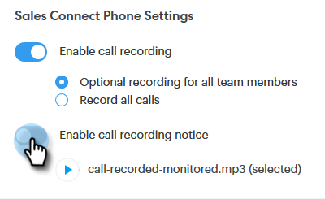

# Einstellungen für Zwei-Parteien-Einverständnis {#two-party-consent-settings}

Um bei der Aufzeichnung von Anrufen die Einhaltung der US-amerikanischen Zwei-Parteien-Einverständnisgesetze sicherzustellen, können Sie als Administrator eine aufgezeichnete Nachricht Ihrer Wahl zu Beginn Ihrer Anrufe wiedergeben lassen, wenn sie aufgezeichnet wird.

>[!PREREQUISITES]
>
>Bevor Sie die folgenden Schritte ausführen, müssen Sie zunächst [Anrufaufzeichnung aktivieren](/help/marketo/product-docs/marketo-sales-connect/phone/enable-call-recording.md).

1. Klicken Sie auf das Symbol Einstellungen und wählen Sie **[!UICONTROL Einstellungen]** aus.

   

1. Klicken [!UICONTROL  unter &quot;]&quot; auf **[!UICONTROL Allgemein]**.

   

1. Scrollen Sie nach unten zu [!UICONTROL Sales Connect-Telefoneinstellungen] und klicken Sie auf **[!UICONTROL Aufzeichnungshinweis verwalten]**.

   

1. Klicken Sie **[!UICONTROL Aufzeichnung importieren]**.

   

   >[!NOTE]
   >
   >Es werden nur Wav- und MP3-Dateien unterstützt. Sie können eine Datei nicht länger als 30 Sekunden hochladen.

1. Wählen Sie die gewünschte Audiodatei von Ihrer Festplatte aus.

   

1. Wählen Sie nach Abschluss des Uploads die Daten (drei Punkte) im Datei-Manager aus und klicken Sie auf **[!UICONTROL Als Einverständniserklärung auswählen]**. Klicken **[!UICONTROL abschließend]** OK“.

   

1. Klicken Sie auf den Umschalter, damit die ausgewählte Nachricht zu Beginn der aufgezeichneten Anrufe abgespielt werden kann.

   
