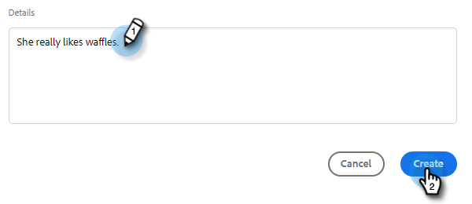

# Erstellen und Zuweisen von Erinnerungsaufgaben {#create-and-assign-reminder-tasks}

Erinnerungsaufgaben eignen sich hervorragend, um Ihren Kunden auf dem Laufenden zu bleiben und eine potenzielle Interaktion zu erzielen. Gehen Sie wie folgt vor, um eine Aufgabe zu erstellen.

1. Klicken Sie auf **Command Center**.

   

1. Aufgaben werden standardmäßig geöffnet. Klicken Sie auf **Aufgabe hinzufügen**.

   

1. Wählen Sie den Aufgabentyp aus E-Mail, Aufruf, InMail oder Benutzerdefinierte Aufgabe aus.

   

1. Geben Sie der Aufgabe einen Namen.

   

1. Wählen Sie aus, ob Sie die Aufgabe selbst zuweisen möchten, oder wählen Sie einen anderen Benutzer aus, dem Sie die Aufgabe zuweisen möchten.

   

1. Fügen Sie die Person hinzu, mit der Sie verfolgen, mit dieser Erinnerungsaufgabe.

   

1. Wählen Sie das Datum aus, an dem die Aufgabe fällig ist.

   

1. Wählen Sie die Priorität der Aufgabe aus.

   

1. Fügen Sie Details zu der Aufgabe hinzu, die Sie beim Abschließen der Aufgabe benötigen, z. B. Anruferbeschreibungen, eine InMail-Nachrichtenvorlage oder Anmerkungen zur Person. Klicken Sie abschließend auf **Erstellen** .

   
