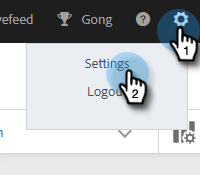

# Inhaltssperre {#content-lockdown}

Durch die Aktivierung der Inhaltssperre können Benutzende ohne Administratorrechte keine Vorlagen und/oder Kampagnen bearbeiten. Benutzende können Inhalte nicht freigeben, klonen, bearbeiten oder löschen. Außerdem haben sie nicht die Möglichkeit, Vorlagen zu archivieren.

>[!NOTE]
>
>Benutzer können den Inhalt einer E-Mail zum Zeitpunkt des Versands oder des Starts einer Kampagne weiterhin bearbeiten.

1. Klicken Sie auf das Zahnradsymbol und wählen Sie **[!UICONTROL Einstellungen]** aus.

   

1. Klicken [!UICONTROL &#x200B; unter &quot;]&quot; auf **[!UICONTROL Allgemein]**.

   

1. Scrollen Sie nach unten [!UICONTROL Content Lockdown]. Wenn Sie einen der Schieberegler aktivieren, können Ihre Team-Mitglieder keine Vorlagen und/oder Kampagnen erstellen/bearbeiten.

   
