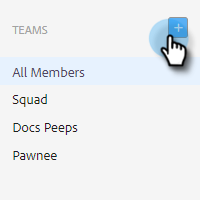

# Team erstellen {#creating-a-team}

Durch die Erstellung eines Teams können Sie eine Benutzergruppe zusammenstellen, für die Inhalte freigegeben werden können, und Berichte können gefiltert werden.

## Team erstellen {#create-a-team}

1. Klicken Sie in der [Webanwendung](https://toutapp.com/login) auf das Zahnradsymbol und wählen Sie **Einstellungen** aus.

   

1. Wählen Sie unter &quot;Admin Settings&quot;die Option **Team Management**.

   

1. Klicken Sie neben Teams auf das Symbol **+** .

   

1. Geben Sie einen Teamnamen ein und klicken Sie auf **Erstellen**.

   

>[!NOTE]
>
>Sie können nun Vorlagen, Kampagnen und Gruppen für dieses Team freigeben.

## Hinzufügen von Personen zu einem Team {#add-people-to-a-team}

1. Wählen Sie im Team Management weiterhin **Alle Mitglieder** aus.

   

1. Suchen Sie die Benutzer, die Sie Ihrem Team hinzufügen möchten, und aktivieren Sie deren Kontrollkästchen.

   

1. Klicken Sie auf **Zu Teams hinzufügen**.

   

1. Klicken Sie auf das Dropdown-Menü und wählen Sie die gewünschten Teams aus.

   

1. Klicken Sie abschließend auf **Hinzufügen** .

   
