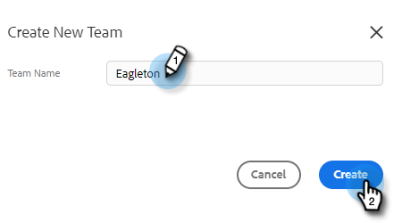

# Erstellen eines Teams {#creating-a-team}

Durch die Erstellung eines Teams können Sie eine Benutzergruppe zusammenstellen, für die Inhalte freigegeben und nach denen Berichte gefiltert werden können.

## Erstellen eines Teams {#create-a-team}

1. Klicken Sie in [Web-Anwendung](https://toutapp.com/login) auf das Zahnradsymbol und wählen Sie **Einstellungen** aus.

   

1. Wählen Sie unter „Admin-Einstellungen **die Option „Team-Verwaltung** aus.

   

1. Klicken Sie neben Teams auf das Symbol **+** .

   

1. Geben Sie einen Team-Namen ein und klicken Sie auf **Erstellen**.

   

>[!NOTE]
>
>Sie können jetzt Vorlagen, Kampagnen und Gruppen für dieses Team freigeben.

## Personen zu einem Team hinzufügen {#add-people-to-a-team}

1. Wählen Sie noch in Team Management **Alle Mitglieder** aus.

   

1. Suchen Sie die Benutzer, die Sie Ihrem Team hinzufügen möchten, und aktivieren Sie deren Kontrollkästchen.

   

1. Klicken Sie **Zu Teams hinzufügen**.

   

1. Klicken Sie auf die Dropdown-Liste und wählen Sie Ihr(e) gewünschte(s) Team(s) aus.

   

1. Klicken Sie abschließend **Hinzufügen**.

   
