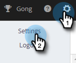

# Einrichten der Verfolgung benutzerdefinierter Domains {#how-to-set-up-custom-domain-tracking}

Mit dem benutzerdefinierten Domain-Tracking kann Ihr Team in allen verfolgbaren Links, die zu Ihren Verkaufs-E-Mails hinzugefügt werden, Ihren eigenen Firmennamen verwenden. Auf die Zulassungsliste setzen Sobald Sie dies eingerichtet haben, werden alle Links in Ihrer E-Mail als go.yourcompany.com angezeigt, sodass, wenn jemand den Mauszeiger über einen Link bewegt, go.yourcompany.com anstelle von go.toutapp.com angezeigt wird.

Sie benötigen die Unterstützung Ihres IT-Teams, um einen CNAME-Eintrag für Ihre Domain einzurichten, der auf go.toutapp.com verweist. Dieser CNAME wird auf allen Tracking-Links angezeigt (z. B. go.yourcompany.com).

Nachdem Sie sich bei Ihrem IT-Team vergewissert haben, dass der CNAME ordnungsgemäß konfiguriert ist, können Sie ihn in Aktionen zur Seite [!UICONTROL Benutzerdefiniertes Domain-Tracking] hinzufügen.

>[!NOTE]
>
>Wenn Ihr CNAME nicht richtig eingerichtet ist und Sie ihn als Ihre benutzerdefinierte Domain in Aktionen aktivieren, kann er Tracking-Links und Pixel beschädigen.

## Benutzerdefiniertes Domain-Tracking aktivieren {#enable-custom-domain-tracking}

>[!NOTE]
>
>**Administratorrechte erforderlich.**

1. Klicken Sie auf das Zahnradsymbol und wählen Sie **[!UICONTROL Einstellungen]** aus.

   

1. Wählen [!UICONTROL  unter „Admin] die Option **[!UICONTROL Tracking]** aus.

   

1. Geben Sie auf der Registerkarte [!UICONTROL Benutzerdefiniertes Domain]Tracking Ihren CNAME ein und klicken Sie auf **[!UICONTROL Verbinden]**.

   
