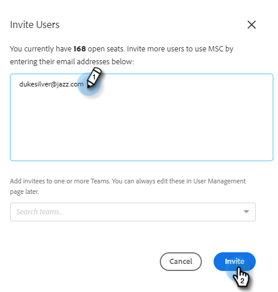
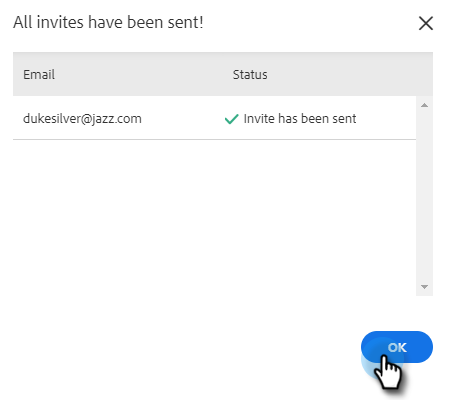

# Benutzer und Administratoren einladen {#invite-users-and-admins}

Das Hinzufügen von Benutzern oder Administratoren ist schnell und einfach!

## Benutzer einladen {#invite-users}

1. Klicken Sie auf das Zahnradsymbol und wählen Sie **Einstellungen**.

   

1. Wählen Sie unter Admin Settings die Option **Benutzerverwaltung**.

   

1. Klicken Sie auf **Aktionen** Schaltfläche und wählen Sie **Benutzer einladen**.

   

   >[!NOTE]
   >
   >Sie können auch **Benutzer über CSV einladen** wenn Sie alle in einer Tabelle aufgeführt haben.

1. Geben Sie die E-Mail-Adressen der Personen an, die Sie hinzufügen möchten.

   

1. OPTIONALER SCHRITT: Fügen Sie die Benutzer zu allen Teams hinzu, denen sie angehören sollten. Wenn Sie diesen Teil überspringen, werden alle neuen Mitglieder zum Team &quot;Alle&quot;hinzugefügt.

   

   >[!NOTE]
   >
   >[Weitere Informationen zu Teams](/help/marketo/product-docs/marketo-sales-insight/actions/admin/creating-a-team.md).

1. Wählen Sie den Marketo-Arbeitsbereich aus, dem Sie die neuen Benutzer hinzufügen möchten. Wenn Sie nur einen Arbeitsbereich haben, sehen Sie als Option &quot;Standard&quot;. Klicks **Einladen**.

   

1. Klicks **OK**.

   

## Benutzer zu einem Administrator machen {#make-a-user-an-admin}

>[!NOTE]
>
>**Administratorberechtigungen erforderlich**

Führen Sie diese Schritte aus, um einen vorhandenen Benutzer als Administrator festzulegen.

1. Klicken Sie auf das Zahnradsymbol und wählen Sie **Einstellungen**.

   

1. Wählen Sie unter Admin Settings die Option **Benutzerverwaltung**.

   

1. Suchen Sie den Benutzer, den Sie als Administrator einrichten möchten, klicken Sie auf das Dropdown-Menü Rolle und wählen Sie **Admin**.

   

So einfach!
