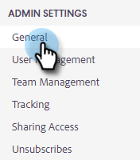

# Anmeldeverwaltungseinstellungen {#login-management-settings}

Mit den Anmeldeverwaltungseinstellungen können Administratoren die Authentifizierungsvoreinstellungen für Benutzer von Sales Insight-Aktionen auf globaler Ebene festlegen.

>[!NOTE]
>
>Standardmäßig ist die Option Nur Salesforce für Instanzen von Sales Insight-Aktionen ausgewählt. Wir empfehlen diese Einstellung, damit Benutzer [automatische Anmeldung](/help/marketo/product-docs/marketo-sales-insight/actions/admin/auto-login-from-salesforce.md) von Salesforce.

## Aktualisieren der Anmeldeverwaltungseinstellungen {#update-login-management-settings}

>[!NOTE]
>
>**Administratorberechtigungen erforderlich**

Gehen Sie wie folgt vor, um Ihre Anmeldeverwaltungseinstellungen zu aktualisieren.

1. Klicken Sie auf das Zahnradsymbol und wählen Sie **Einstellungen**.

   

1. Klicken Sie unter &quot;Admin Settings&quot;auf **Allgemein**.

   

1. Scrollen Sie nach unten zur Karte Anmeldeverwaltung und wählen Sie die gewünschte Einstellung aus (in diesem Beispiel wählen wir nur Salesforce aus). Klicks **Speichern** wann geschehen.

   

## Häufig gestellte Fragen zu Salesforce {#salesforce-only-faq}

Salesforce bedeutet nur, dass Benutzer sich nur für die Verwendung von Sales Insight-Aktionen mit Salesforce authentifizieren können. Es handelt sich um die Standardauswahl für Instanzen von Sales Insight-Aktionen. Es wird empfohlen, Benutzern die nahtlose Authentifizierung zu ermöglichen, ohne einen Benutzernamen und ein Kennwort verwalten zu müssen.

### Wie aktiviert ein neuer Benutzer in meiner Instanz sein Konto, wenn &quot;Nur Salesforce&quot;ausgewählt ist? {#activate-when-salesforce-only-is-selected}

Beim Klicken auf **Erste Schritte** in der Einladungs-E-Mail werden neue Benutzer an einen Bildschirm zur Kontoaktivierung gesendet, auf dem sie ihre Salesforce-Instanz verbinden müssen, um ihr Konto für Einblicke in Verkaufsaktionen zu aktivieren.

### Mit welchen Authentifizierungsmethoden dürfen sich meine Benutzer authentifizieren, wenn &quot;Nur Salesforce&quot;ausgewählt ist? {#what-authentication-methods}

Beim Navigieren zu unserem Anmeldebildschirm geben Benutzer zunächst ihre E-Mail-Adresse ein. Anschließend klicken sie auf die Schaltfläche Salesforce One Click Login , wo sie sich über das Salesforce-Konto authentifizieren können, bei dem sie angemeldet sind.

>[!NOTE]
>
>Dies gilt nur für Benutzer, die direkt zum Anmeldebildschirm navigieren. Benutzer, die über Salesforce auf Aktionen zugreifen, werden bei [Automatische Anmeldung](/help/marketo/product-docs/marketo-sales-insight/actions/admin/auto-login-from-salesforce.md).

### Wie wird die Benutzerauthentifizierung für Aktionen gehandhabt, wenn ein Benutzer über Salesforce auf eine Aktionsfunktion zugreift und &quot;Nur Salesforce&quot;ausgewählt ist? {#how-is-user-authentication-handled}

Wenn ein Benutzer auf eine der Aktionen klickt (Aufruf, E-Mail, Kampagne, Aufgaben, Kampagnenliste usw.), verwenden wir seine SFDC-Authentifizierung, um ihn automatisch bei seinem Konto für Einblicke in Verkaufsaktionen zu melden. Wir nennen diese Authentifizierung [Automatische Anmeldung](/help/marketo/product-docs/marketo-sales-insight/actions/admin/auto-login-from-salesforce.md).

## Häufig gestellte Fragen zu allen Anmeldemethoden {#all-login-methods-faq}

### Wie aktiviert ein neuer Benutzer in meiner Instanz sein Konto, wenn &quot;Alle Anmeldemethoden&quot;ausgewählt ist? {#activate-when-all-login-methods-is-selected}

Wenn ein neuer Benutzer zu einer Instanz eingeladen wird, erhält er eine E-Mail zur Kontoaktivierung. Er klickt auf die Schaltfläche &quot;Erste Schritte&quot;, die ihn auf eine Seite bringt, auf der er aufgefordert wird, ein Passwort zu erstellen und zu bestätigen. Nach der Erstellung wird ihr Konto aktiviert und über den Onboarding-Workflow abgerufen.

### Welche Benutzer meiner Instanz dürfen sich mit anmelden, wenn &quot;Alle Anmeldemethoden&quot;ausgewählt ist? {#what-are-users-allowed-to-log-in-with-all-login}

Bei Verwendung unserer Anmeldeseite geben Benutzer zunächst ihre E-Mail-Adresse ein. Dann werden sie an eine Seite gesendet, auf der sie alle Anmeldeoptionen (Benutzername/Kennwort, SFDC, Gmail, SSO) für die Authentifizierung erhalten.
