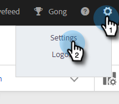

# Freigabeeinstellungen {#sharing-settings}

Verwalten Sie Ihre Vorlagen besser, indem Sie einschränken, was Benutzende mit welchen Kategorien teilen können.

Bei der erstmaligen Erstellung Ihres Kontos für Sales Insight-Aktionen ist die Option Freigabeeinstellungen aktiviert. Dadurch haben Ihre Kontoadministratoren die Möglichkeit, Ihre Vorlagenkategorien zu erstellen und zu organisieren, bevor sie die Schleusentore öffnen, und Benutzern die Freigabe von Inhalten in Ihren Team-Kategorien zu ermöglichen.

Wenn die Freigabeeinstellungen aktiviert ist, können nur Administratoren Inhalte in Kategorien freigeben, es sei denn, die Freigabeberechtigungen werden einem Team oder allen Benutzern erteilt. Wenn die Freigabeeinstellungen deaktiviert sind, gibt es keine Einschränkungen und alle Benutzenden können Inhalte für beliebige Vorlagenkategorien freigeben.

## Konfigurieren der Freigabeeinstellungen {#configure-your-sharing-settings}

1. Klicken Sie in [Web-Anwendung](https://toutapp.com/login) auf das Zahnradsymbol und wählen Sie **[!UICONTROL Einstellungen]** aus.

   

1. Wählen [!UICONTROL  unter „Admin] die Option **[!UICONTROL Zugriff freigeben]** aus.

   

1. Stellen Sie sicher **[!UICONTROL dass „Freigabeeinstellungen]** aktiviert ist. Das bedeutet, dass standardmäßig nur Administratoren Vorlagen in Ihren Vorlagenkategorien freigeben können.

   

1. Wählen Sie die Vorlagenkategorie aus, die Sie konfigurieren möchten.

   

1. Klicken Sie **[!UICONTROL Teams für Zugriff hinzufügen]**.

   

1. Wählen Sie die Teams aus, die Sie hinzufügen möchten.

   

   >[!NOTE]
   >
   >Wenn Sie keine Teams sehen, müssen Sie zu Team Management gehen und ein Team von Benutzern erstellen.

1. Klicken Sie **[!UICONTROL Teams für Zugriff hinzufügen]** um zu speichern.

   

1. Nachdem Ihr Team hinzugefügt wurde, können Sie festlegen, dass nur Team-Administratoren bzw. -Administratorinnen für alle Benutzenden in diesem Team freigeben dürfen. In diesem Beispiel gewähren wir allen Benutzenden des SDR-Teams gemeinsamen Zugriff.

   
