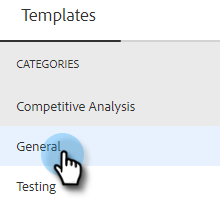

# Weitergabe-Einstellungen {#sharing-settings}

Optimieren Sie die Verwaltung Ihrer Vorlagen, indem Sie einschränken, welche Benutzer für welche Kategorien freigegeben werden können.

Wenn Ihr Sales Insight-Aktionskonto zum ersten Mal erstellt wird, ist die Option Freigabeeinstellungen aktiviert. Dadurch erhalten Ihre Kontoadministratoren die Möglichkeit, Ihre Vorlagenkategorien zu erstellen und zu organisieren, bevor die Startpunkte geöffnet werden, und Benutzern die Möglichkeit zu geben, Inhalte in Ihren Teamkategorien zu teilen.

Wenn die Freigabeeinstellungen aktiviert sind, können nur Administratoren in Kategorien freigegeben werden, es sei denn, einem Team oder allen Benutzern werden Freigabeberechtigungen gewährt. Wenn die Freigabeeinstellungen deaktiviert sind, gibt es keine Einschränkungen und alle Benutzer können in beliebige Vorlagenkategorien freigeben.

## Konfigurieren Ihrer Freigabeeinstellungen {#configure-your-sharing-settings}

1. Im [Webanwendung](https://toutapp.com/login), klicken Sie auf das Zahnradsymbol und wählen Sie **Einstellungen**.

   

1. Wählen Sie unter Admin Settings die Option **Zugriff freigeben**.

   

1. Stellen Sie sicher **Freigabeeinstellungen** aktiviert ist. Dies bedeutet standardmäßig, dass nur Administratoren Vorlagen in Ihren Vorlagenkategorien freigeben können.

   

1. Wählen Sie die Vorlagenkategorie aus, die Sie konfigurieren möchten.

   

1. Klicks **Team für Zugriff hinzufügen**.

   

1. Wählen Sie die Teams aus, die Sie hinzufügen möchten.

   

   >[!NOTE]
   >
   >Wenn Sie keine Teams sehen, müssen Sie zu Team Management gehen und ein Team von Benutzern erstellen.

1. Klicks **Team für Zugriff hinzufügen** speichern.

   

1. Nachdem Ihr Team hinzugefügt wurde, können Sie festlegen, dass nur Teamadministratoren oder alle Benutzer dieses Teams freigeben dürfen. In diesem Beispiel gewähren wir allen Benutzern des SDR-Teams Zugriff auf die Freigabe.

   
