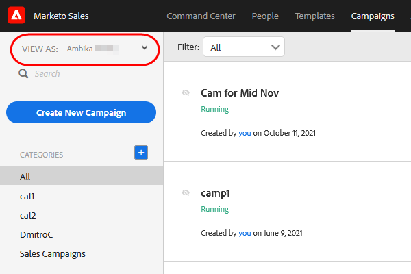

# Details zum Benutzerzugriff {#user-access-details}

Auf was haben Administratoren und Nicht-Administratoren Zugriff?

## Administratorbenutzer-Berechtigungen {#admin-user-permissions}

Administratoren können [alle Vorlagen anzeigen](/help/marketo/product-docs/marketo-sales-connect/templates/view-template-list-as-another-user.md).

Administratoren können [alle Kampagnen anzeigen](/help/marketo/product-docs/marketo-sales-connect/campaigns/view-campaigns-list-as-another-user.md).

Administratoren können alle E-Mail-Aktivitäten anzeigen.

Administratoren können alle Personen in einer laufenden Kampagne anzeigen.

Admins können Benutzende, Kampagnen und Kampagnenkategorien über die Dropdown[!UICONTROL Liste Anzeigen als] anzeigen.

Administratoren können Kampagnen im Namen von Benutzern stoppen.

## Benutzerberechtigungen ohne Administratorrechte {#non-admin-user-permissions}

* Analytics:

   * Benutzer können Team Analytics anzeigen
   * Benutzer können einen Drill-in nur für die Teams durchführen, zu denen sie gehören
   * Benutzer können ihre eigenen Analysen betrachten

* [!UICONTROL Personen] Seite:

   * Benutzende können Gruppen für alle freigeben
   * Benutzende können Gruppen nur für die Teams freigeben, zu denen sie gehören
   * Benutzer haben Sichtbarkeit für alle Personen in Ihrer Aktionsdatenbank
   * Wenn ein Benutzer gelöscht wird, übertragen seine freigegebenen Kontakte das Eigentum an den primären Administrator, der den Benutzer gelöscht hat

* [!UICONTROL Team] Verwaltungsseite:

   * Nicht anzeigen

* [!UICONTROL Vorlagen] Seite:

   * Benutzer können Vorlagen für alle freigeben
   * Benutzende können Vorlagen in Kategorien freigeben, die ihre Admins ihnen erlauben
   * Wenn ein(e) Benutzende(r) aus einem Team entfernt wird, wird die Freigabe seiner Vorlagen für dieses Team aufgehoben
   * Wenn ein(e) Benutzende(r) aus einem Team gelöscht wird, überträgt seine/ihre Vorlage das Eigentum an den Master-Administrator/in, der/die den/die Benutzende gelöscht hat
