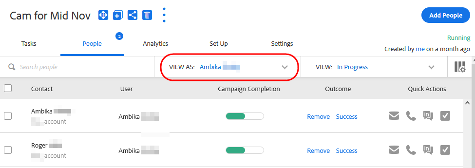

# Benutzerzugriffsdetails {#user-access-details}

Auf was können Administratoren und Benutzer ohne Administratorrechte zugreifen?

## Admin-Benutzerberechtigungen {#admin-user-permissions}

Administratoren können [Alle Vorlagen anzeigen](/help/marketo/product-docs/marketo-sales-connect/templates/view-template-list-as-a-another-user.md).

Administratoren können [Alle Kampagnen anzeigen](/help/marketo/product-docs/marketo-sales-connect/campaigns/view-campaigns-list-as-another-user.md).

Administratoren können alle E-Mail-Aktivitäten anzeigen.

Administratoren können alle Personen einer laufenden Kampagne sehen.

Administratoren können Benutzerkampagnen und Kampagnenkategorien über das Dropdown-Menü Anzeigen als anzeigen.

Administratoren können Kampagnen im Namen von Benutzern stoppen.

## Benutzerberechtigungen ohne Administratorrechte {#non-admin-user-permissions}

* Analytics:

   * Benutzer können Teamanalysen anzeigen
   * Benutzer können einen Drilldown in nur die Teams durchführen, denen sie angehören
   * Benutzer können sich ihre eigenen Analysen ansehen

* Personenseite:

   * Benutzer können Gruppen für alle freigeben
   * Benutzer können Gruppen nur für Teams freigeben, denen sie angehören
   * Die Benutzer können alle Personen in Ihrer Aktionsdatenbank einsehen.
   * Wenn ein Benutzer gelöscht wird, überträgt sein freigegebener Kontakt das Eigentum an den Übergeordneten Administrator, der den Benutzer gelöscht hat

* Seite &quot;Teamverwaltung&quot;:

   * Ansicht nicht möglich

* Vorlagenseite:

   * Benutzer können Vorlagen für alle freigeben
   * Benutzer können Vorlagen in Kategorien freigeben, die ihnen Administratoren ermöglichen
   * Wenn ein Benutzer aus einem Team entfernt wird, wird die Freigabe seiner Vorlagen für dieses Team aufgehoben
   * Wenn ein Benutzer aus einem Team gelöscht wird, übertragen seine Vorlagen das Eigentum an den Übergeordneten Administrator, der den Benutzer gelöscht hat
