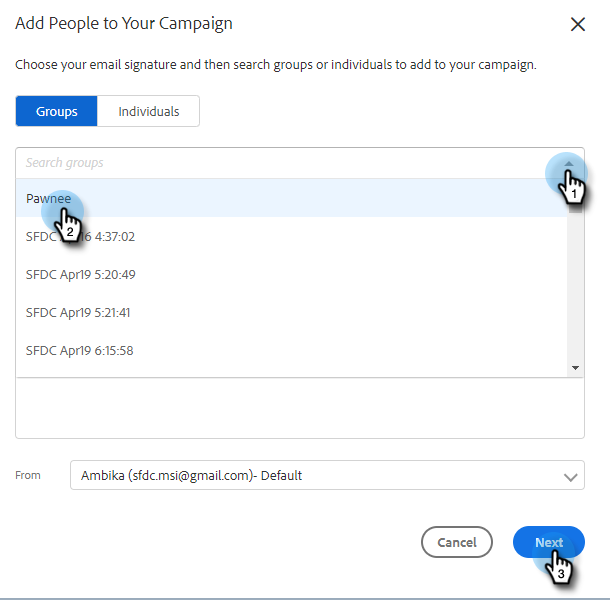

# Zur Marketing-Kampagne hinzufügen {#add-to-marketing-campaign}

>[!PREREQUISITES]
>
>[Machen Sie eine Kampagne für Vertriebsbenutzer sichtbar](/help/marketo/product-docs/marketo-sales-insight/actions/marketo/make-a-marketing-campaign-visible-in-sales-insight-actions.md)

## Personen zu einer Kampagne hinzufügen {#add-individuals-to-a-campaign}

>[!NOTE]
>
>Um eine Person über Sales Connect zu einer Marketo-Kampagne hinzuzufügen, muss Sales Connect über die Marketo-Lead-ID der Person verfügen.

1. Klicken Sie auf **Registerkarte** Personen“.

   

1. Suchen Sie die Kontakte, die Sie hinzufügen möchten.

   

1. Aktivieren Sie das Kontrollkästchen, um Ihre Kontakte auszuwählen, und klicken Sie auf **Auswahl zu Campaign hinzufügen**.

   

1. SCHRITT HERE

   

1. Da Sie einer Marketing-Kampagne hinzufügen, überspringen Sie die Auswahl einer „Von“-Adresse. Sie können jedoch auch weitere Kontakte hinzufügen. Wenn Sie möchten, klicken Sie auf Einzelpersonen und geben Sie sie ein. Klicken Sie abschließend **Weiter**.

   

1. Klicken Sie **Marketing-Kampagne**.

PICC

1. Klicken Sie auf das Dropdown-Menü Arbeitsbereiche und wählen Sie den Arbeitsbereich aus, der die Kampagne enthält, der die Gruppe hinzugefügt werden soll.

PICC

>[!NOTE]
>
>Wenn der gewünschte Arbeitsbereich nicht angezeigt wird, stellen Sie sicher, dass er von Ihrem Admin über die Zugriffsseite Ihres Marketo-Teams bereitgestellt wird.

1. Wählen Sie die gewünschte Kampagne aus und klicken Sie auf **Weiter**.

PICC

1. Ihnen werden die Kontakte angezeigt, die qualifiziert sind. Klicken Sie **Start**, um sie hinzuzufügen.

PICC

## Hinzufügen einer Gruppe zu einer Kampagne {#add-a-group-to-a-campaign}

1. Klicken Sie auf **Registerkarte** Personen“.

PICC

1. Wählen Sie unter Meine Gruppen die Gruppe aus, die Sie einer Kampagne hinzufügen möchten.

PICC

1. Klicken Sie **Gruppe zu Kampagne hinzufügen**.

PICC

1. Da Sie einer Marketing-Kampagne hinzufügen, überspringen Sie die Auswahl einer „Von“-Adresse. Sie können jedoch auch weitere Kontakte hinzufügen. Wenn Sie möchten, klicken Sie auf Einzelpersonen und geben Sie sie ein. Klicken Sie abschließend **Weiter**.

PICC

1. Wählen Sie **Marketing-Kampagne** aus.

PICC

>[!NOTE]
>
>Um eine Person über Sales Connect zu einer Marketo-Kampagne hinzuzufügen, muss Sales Connect über die Marketo-Lead-ID der Person verfügen.

1. Klicken Sie auf das Dropdown-Menü Arbeitsbereiche und wählen Sie den Arbeitsbereich aus, der die Kampagne enthält, der die Gruppe hinzugefügt werden soll.

PICC

>[!NOTE]
>
>Wenn der gewünschte Arbeitsbereich nicht angezeigt wird, stellen Sie sicher, dass er von Ihrem Admin über die Zugriffsseite Ihres Marketo-Teams bereitgestellt wird.

1. Wählen Sie die gewünschte Kampagne aus und klicken Sie auf **Weiter**.

PICC

1. Ihnen werden die Kontakte angezeigt, die qualifiziert sind. Klicken Sie **Start**, um sie hinzuzufügen.

PICC
