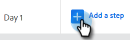
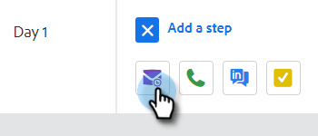

# Erstellen einer Verkaufskampagne {#create-a-sales-campaign}

Verkaufskampagnen bestehen aus einer Reihe von kanalübergreifenden Schritten, darunter E-Mails, Telefonanrufe, InMail und benutzerdefinierte Aufgaben. Sie ermöglichen es Ihnen, Ihre Kommunikation mit Ihren potenziellen und bestehenden Kunden zu optimieren.

Mit Verkaufskampagnen können Sie:

* **Organisieren**: Optimieren Sie all Ihre Outreach-Aktivitäten an einem Ort für eine effiziente Ausführung.
* **Skalieren**: Planen Sie all Ihre Outreach-Maßnahmen, um Ihre Bemühungen zu skalieren, manuelle Arbeit zu minimieren und so viel zu personalisieren, wie Sie benötigen.
* **Messen**: Verfolgen Sie den Erfolg aller E-Mails und Aufgaben an einem Ort, während Sie sie automatisch bei [!DNL Salesforce] anmelden. Indem Sie wissen, was Resonanz findet und zu Ergebnissen führt, können Sie Ihre Ergebnisse konsistent testen und verbessern.

Wie richtet man also eine Verkaufskampagne ein?

1. Klicken Sie auf **[!UICONTROL Registerkarte]** Kampagnen“.

   

1. Wählen Sie eine Kategorie aus und klicken Sie auf **[!UICONTROL Schaltfläche „Neue Kampagne erstellen]**.

   

   >[!NOTE]
   >
   >Erstellen Sie eine neue Kategorie, indem Sie auf das **+** neben &quot;**[!UICONTROL &quot;]**.

1. Die ausgewählte Kategorie wird ausgewählt. Wenn Sie es sich anders überlegen, klicken Sie auf die Dropdown-Liste und wählen Sie eine andere aus. Wenn Sie fertig sind, klicken Sie auf **[!UICONTROL Weiter]**.

   

1. Klicken Sie **[!UICONTROL Schritt hinzufügen]**.

   

1. Wählen Sie zwischen: E-Mail, Anruf, InMail oder Benutzerdefinierte Aufgabe. In diesem Beispiel wählen wir „E-Mail“.

   

1. Wenn Sie mit [&#x200B; E-Mail fertig sind](/help/marketo/product-docs/marketo-sales-insight/actions/campaigns/sales-campaign-step-types-and-reminder-tasks.md#email){target="_blank"} klicken Sie auf **[!UICONTROL Hinzufügen]**.

   

1. Nachdem Sie Ihren ersten Tag und Schritt erstellt haben, wird die Schaltfläche &quot;[!UICONTROL Tag hinzufügen] aktiviert, und Sie können so viele Tage und Schritte hinzufügen, wie Ihr Verkaufsprozess erfordert.

   

   >[!NOTE]
   >
   >„Tage“ sind nicht die Anzahl der Tage zwischen Aktionen, sondern der Tag innerhalb der Sequenz. Wenn Ihre Verkaufskampagne beispielsweise 7 Tage dauert, bedeutet die Eingabe von „3“, dass die Aktion am 3. von 7 Tagen ausgeführt wird, **3** später.

1. Stellen Sie sicher, dass Sie die Planungs- und Antwortoptionen anpassen, z. B. Wochenenden überspringen (was großartig ist), indem Sie die Registerkarte **[!UICONTROL Einstellungen] für** Verkaufskampagne aufrufen.

   

Jetzt ist es an der Zeit, Leute hinzuzufügen!

>[!MORELIKETHIS]
>
>* [Schrittarten und Erinnerungsaufgaben der Verkaufskampagne](/help/marketo/product-docs/marketo-sales-insight/actions/campaigns/sales-campaign-step-types-and-reminder-tasks.md){target="_blank"}
>* [Einstellungen für Verkaufskampagnen](/help/marketo/product-docs/marketo-sales-insight/actions/campaigns/sales-campaign-settings.md){target="_blank"}
