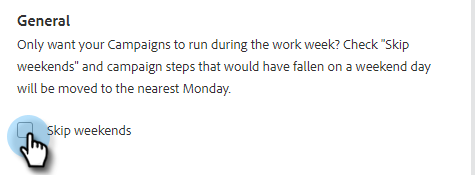

# Einstellungen für Verkaufskampagnen {#sales-campaign-settings}

Im Abschnitt Einstellungen für Vertriebskampagnen können Sie eine bestimmte Verkaufskampagne konfigurieren, damit sie am besten zu den Anwendungsfällen Ihres Teams für diese Verkaufskampagne passt.

## Wochenenden überspringen {#skip-weekends}

Aktivieren Sie Wochenenden überspringen , damit alle Schritte, die an einem Wochenendtag (Samstag oder Sonntag) gefallen wären, auf Montag verschoben werden.

>[!NOTE]
>
>Bei aktiviertem „Wochenende überspringen“ werden E-Mails auf der Grundlage einer 5-Tage-Woche geplant. Das bedeutet, dass bei der Planung eines Schritts die Wochenenden als Tage ignoriert werden.

1. Klicken Sie **Kampagnen**.

   

1. Wählen Sie Ihre gewünschte Verkaufskampagne.

   

1. Klicken Sie auf **Registerkarte** Einstellungen“.

   

1. Aktivieren Sie das **Wochenenden überspringen**.

   

## Bei Bounce entfernen {#remove-on-bounce}

Wenn Sie eine E-Mail-Verbindung verwenden, erkennen wir Bounces anhand der Bounce-Nachricht, die an den Posteingang der Benutzer gesendet wird. Darüber hinaus können wir Personen aus Verkaufskampagnen entfernen, wenn ein Bounce erkannt wird.

1. Klicken Sie **Kampagnen**.

   

1. Wählen Sie Ihre gewünschte Verkaufskampagne.

   

1. Klicken Sie auf **Registerkarte** Einstellungen“.

   

1. Aktivieren Sie das **Bei Bounce entfernen**.

   

## Wenn eine Antwort erfolgt {#if-a-reply-occurs}

Wenn Sie das Antwort-Tracking für Gmail oder Exchange aktiviert haben, können wir Ihre Verkaufskampagne automatisch senden, wenn ein Empfänger auf Ihre E-Mail antwortet.

1. Klicken Sie **Kampagnen**.

   

1. Wählen Sie Ihre gewünschte Verkaufskampagne.

   

1. Klicken Sie auf **Registerkarte** Einstellungen“.

   

1. Treffen **unter „Wenn eine Antwort eintritt** die gewünschte(n) Auswahl(en).

   

>[!MORELIKETHIS]
>
>* [Erstellen einer Verkaufskampagne](/help/marketo/product-docs/marketo-sales-insight/actions/campaigns/create-a-sales-campaign.md){target="_blank"}
>* [Verstehen der Versandoptionen für Verkaufskampagnen für E-Mail-Schritte](/help/marketo/product-docs/marketo-sales-insight/actions/campaigns/understanding-sales-campaign-send-options-for-email-steps.md){target="_blank"}
>* [Schrittarten und Erinnerungsaufgaben der Verkaufskampagne](/help/marketo/product-docs/marketo-sales-insight/actions/campaigns/sales-campaign-step-types-and-reminder-tasks.md){target="_blank"}
