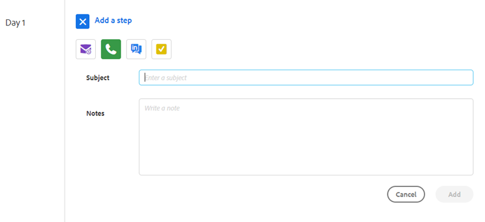
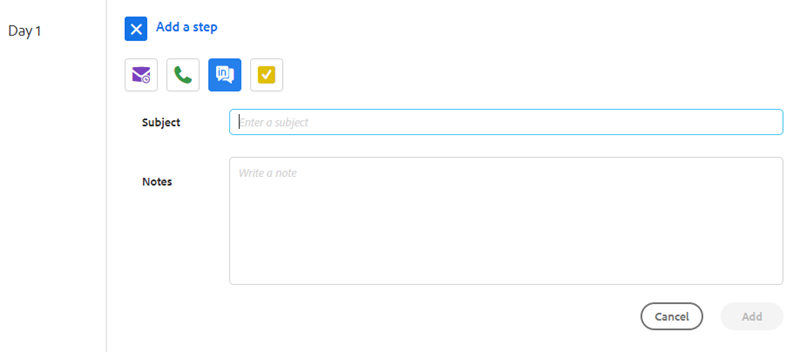

# Schritttypen und Erinnerungsaufgaben für Vertriebskampagnen {#sales-campaign-step-types-and-reminder-tasks}

## Schritttypen von Vertriebskampagnen {#sales-campaign-step-types}

Beim Hinzufügen eines Schritts zu Ihrer Vertriebskampagne haben Sie vier Optionen.

### E-Mail {#email}

Erstellen Sie eine neue E-Mail oder verwenden Sie eine bereits vorhandene Vorlage.

| **Eine Vorlage verwenden** | Wählen Sie eine Ihrer bereits existierenden Vorlagen aus |
|---|---|
| **Als Vorlage speichern** | Speichern Sie die gerade erstellte E-Mail als neue Vorlage |
| **Inhalt hinzufügen** | Laden Sie eine Datei auf unseren Server hoch und erhalten Sie eine URL (die auf den Inhalt verweist), die in Ihrer E-Mail verfolgt werden kann. |
| **Dateien anhängen** | Datei von Ihrem Computer an die E-Mail anhängen (Größenbeschränkung von 23 MB) |

>[!TIP]
>
>Informationen zu Ihren [Versandoptionen](/help/marketo/product-docs/marketo-sales-insight/actions/campaigns/understanding-sales-campaign-send-options-for-email-steps.md){target="_blank"}.

### Anruf {#call}

Legen Sie eine Erinnerung fest, um einen Kontakt per Telefon zu verfolgen. Sie können auch Notizen speichern, die während des Aufrufs als Talktrack verwendet werden.

### InMail {#inmail}

Das Nachverfolgen mehrerer Kanäle ist eine hervorragende Möglichkeit, eine Verbindung mit Leads herzustellen. Mit InMail-Aufgaben können Sie eine Erinnerung einrichten, die über LinkedIn kontaktiert werden kann.

### Benutzerdefinierte Aufgabe {#custom-task}

Verwenden Sie benutzerdefinierte Aufgaben, wenn die oben genannten Optionen nicht anwendbar sind. Sie können beispielsweise einen Kollegen einladen, einen Lead per E-Mail zu verfolgen.

## Verwenden von Erinnerungsaufgaben in Verkaufskampagnen {#using-reminder-tasks-in-sales-campaigns}

Aufgaben sind ein leistungsstarkes Tool, wenn Sie eine Vertriebskampagne an einen Kontakt senden, insbesondere wenn Ihr Verkaufsprozess mehrere Kanäle/Touch umfasst.

Die häufigsten Verwendungszwecke für Aufgaben in Verkaufskampagnen sind das Senden einer E-Mail und das Aufrufen eines Kontakts durch eine Aufgabe.

Sie können auch eine &quot;Aufgabe an Inmail&quot; in LinkedIn kontaktieren, wenn dies Teil Ihres Workflows ist. Sie können auch eine benutzerdefinierte Aufgabe erstellen, um Sie daran zu erinnern, sie zu einer Happy Hour einzuladen, nach ihrem Wohltätigkeitsereignis zu fragen oder nach Spiel 5 einzuchecken, etc.

>[!NOTE]
>
>Das Wichtigste an Aufgaben in Verkaufskampagnen ist, dass Sie die Aufgabe abschließen müssen, um den nächsten Trigger abzuschließen.

>[!MORELIKETHIS]
>
>[Erstellen einer Verkaufskampagne](/help/marketo/product-docs/marketo-sales-insight/actions/campaigns/create-a-sales-campaign.md){target="_blank"}
