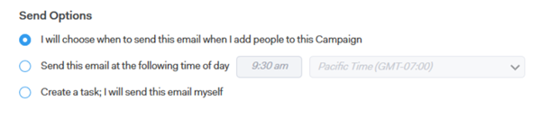

# Grundlagen zu den Versandoptionen von Vertriebskampagnen für E-Mail-Schritte {#understanding-sales-campaign-send-options-for-email-steps}

Beim Erstellen einer Vertriebskampagne haben Sie mehrere Optionen, wie Ihre E-Mail-Schritte in Sales Insight-Aktionen erstellt werden. Und je nachdem, wo Ihre E-Mail in Ihre Vertriebskampagne fällt, unterscheiden sich auch Ihre Optionen.

## Optionen zum Senden eines ersten Schritts {#first-step-send-options}

Wenn es Ihr erster Schritt und der erste Tag in Ihrer Vertriebskampagne ist, haben Sie die folgenden Optionen:

### Ich werde entscheiden, wann diese E-Mail gesendet werden soll {#first-step-i-will-choose}

* Mit dieser Option können Sie die &quot;Versandzeit&quot;für die erste E-Mail in Ihrer Vertriebskampagne auswählen, wenn Sie die Verkaufskampagne starten, indem Sie Personen hinzufügen.

### Diese E-Mail zum folgenden Zeitpunkt senden {#first-step-following-time}

* Wenn Sie Ihre Vertriebskampagne durch Hinzufügen von Personen starten, planen wir die E-Mail für diese Zeit.
* Sie haben immer die Möglichkeit, einen neuen &quot;Versand am&quot;-Zeitpunkt zu wählen, wenn Sie Ihre Vertriebskampagne starten.

### Eine Aufgabe erstellen: Ich werde diese E-Mail selbst senden {#first-step-create-a-task}

* Mit dieser Option wird eine E-Mail-Aufgabe erstellt (und mit Salesforce synchronisiert), die Sie nach Belieben senden können.
* Wenn Sie diese Auswahl getroffen haben und Ihre Vertriebskampagne starten, werden wir diese Aufgaben im Command Center und im Live Feed für Sie in die Warteschlange stellen. Sie können dann jede E-Mail personalisieren und senden (oder planen), bevor sie abläuft.

   * Wenn Sie diese Aufgabe in unserer Webanwendung öffnen, wird ein Komprimierungsfenster mit der E-Mail-Adresse Ihres Kontakts, der Betreffzeile Ihrer E-Mail und der von Ihnen ausgewählten Vorlage geöffnet.
   * Wenn Sie diese Aufgabe in Gmail oder Outlook öffnen, wird ein natives Komprimierungsfenster geöffnet, in dem Sie die E-Mail-Adresse Ihres Kontakts, die Betreffzeile Ihrer E-Mail und die von Ihnen ausgewählte Vorlage dynamisch ausfüllen.

## Optionen für nachfolgenden Schritt-Versand {#subsequent-step-send-options}

Für alle nachfolgenden Tage/Schritte in Ihrer Verkaufskampagne stehen folgende Optionen zur Verfügung:

### Senden Sie diese E-Mail gleichzeitig mit der vorherigen E-Mail in dieser Verkaufskampagne {#subsequent-send-at-same-time}

* Diese Option sendet die E-Mail gleichzeitig mit der E-Mail direkt vor der E-Mail.
* Er wird weiterhin an dem Tag gesendet, an dem er verknüpft ist.

>[!IMPORTANT]
>
>Das Senden einer E-Mail zur selben Zeit wie die vorherige E-Mail wird für E-Mails, die am selben Tag gesendet werden, nicht unterstützt. Stattdessen wird die E-Mail zum Zeitpunkt des E-Mail-Versands vom Vortag gesendet. Wenn diese Option am ersten Tag der Kampagne für eine E-Mail ausgewählt wird (nicht empfohlen), wird diese E-Mail sofort zu Beginn der Kampagne gesendet.

### Diese E-Mail zum folgenden Zeitpunkt senden {#subsequent-send-at-following-time}

* Wenn Sie Ihre Vertriebskampagne durch Hinzufügen von Personen starten, planen wir die E-Mail für diese Zeit.
* Sie haben immer die Möglichkeit, einen neuen &quot;Versand am&quot;-Zeitpunkt zu wählen, wenn Sie Ihre Vertriebskampagne starten.

### Eine Aufgabe erstellen: Ich werde diese E-Mail selbst senden {#subsequent-create-a-task}

* Mit dieser Option wird eine E-Mail-Aufgabe erstellt (und mit Salesforce synchronisiert), die Sie nach Belieben senden können.
* Sobald Sie diese Auswahl getroffen haben, werden diese Aufgaben beim Start Ihrer Sales Campaign mit Sales Insight Actions im Command Center und im Live Feed in die Warteschlange gestellt. Sie können dann jede E-Mail personalisieren und senden (oder planen), bevor sie abläuft.

   * Wenn Sie diese Aufgabe in unserer Webanwendung öffnen, wird ein Komprimierungsfenster mit der E-Mail-Adresse Ihres Kontakts, der Betreffzeile Ihrer E-Mail und der von Ihnen ausgewählten Vorlage geöffnet.
   * Wenn Sie diese Aufgabe in Gmail oder Outlook öffnen, wird ein natives Komprimierungsfenster geöffnet, in dem Sie die E-Mail-Adresse Ihres Kontakts, die Betreffzeile Ihrer E-Mail und die von Ihnen ausgewählte Vorlage dynamisch ausfüllen.

### Erstellen Sie diese E-Mail im Anschluss an die vorherige E-Mail in dieser Kampagne. {#subsequent-create-this-email}

* Aktivieren Sie dieses Kontrollkästchen, wenn die vorherige E-Mail in Ihrer Verkaufskampagne an die nächste E-Mail angehängt werden soll, die Ihre Verkaufskampagne versendet.
* Für die angehängte Kopie der E-Mail wird die E-Mail-Vorlage in Ihrer Verkaufskampagne immer gesendet. Änderungen, die der Benutzer vor dem Versand vorgenommen hat, werden nicht in den Versand einbezogen.

>[!NOTE]
>
>Diese Option zum Erstellen einer E-Mail als Follow-up ist nur bei einem E-Mail-Schritt verfügbar, wenn der vorherige Schritt auch eine E-Mail ist. Wenn der vorherige Schritt &quot;Aufruf&quot;, &quot;InMail&quot;oder &quot;Benutzerdefiniert&quot;lautet, wird die Option zum Erstellen einer Nachverfolgung nicht angezeigt.

>[!MORELIKETHIS]
>
>[Erstellen einer Verkaufskampagne](/help/marketo/product-docs/marketo-sales-insight/actions/campaigns/create-a-sales-campaign.md){target="_blank"}
>[Schritttypen und Erinnerungsaufgaben für Vertriebskampagnen](/help/marketo/product-docs/marketo-sales-insight/actions/campaigns/sales-campaign-step-types-and-reminder-tasks.md){target="_blank"}
>[Einstellungen für Vertriebskampagnen](/help/marketo/product-docs/marketo-sales-insight/actions/campaigns/sales-campaign-settings.md){target="_blank"}
