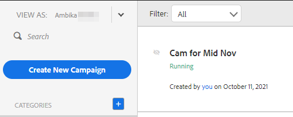

# Anzeigen der Kampagnenliste als andere Benutzerin bzw. anderer Benutzer {#view-campaigns-list-as-another-user}

Als Administrator können Sie Kampagnen als beliebige Benutzende anzeigen.

>[!NOTE]
>
>**Administratorberechtigungen erforderlich**

1. Klicken Sie in der Web-Anwendung auf **[!UICONTROL Kampagnen]**.

   

1. Klicken Sie auf **[!UICONTROL Anzeigen als]** und wählen Sie den gewünschten Benutzer aus.

   

1. Sie zeigen jetzt Kampagnen als ausgewählten Benutzer an.

   

   >[!NOTE]
   >
   >Sie können auch Filter oder die Suchfunktion zusammen mit &quot;[!UICONTROL  anzeigen als] verwenden, um anzuzeigen, was für Sie am relevantesten ist.
