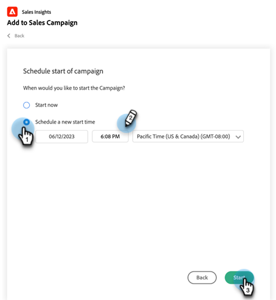

# Verwenden von Massen-Add zu Verkaufskampagnen in Salesforce {#using-bulk-add-to-sales-campaign-in-salesforce}

Erfahren Sie, wie Sie in Salesforce Bulk zu Sales Campaign hinzufügen können, um Ihre ausgehende Kommunikation mithilfe von Verkaufsaktionen zu skalieren.

>[!NOTE]
>
>Salesforce erzwingt eine Beschränkung von 200 Datensätzen, die gleichzeitig ausgewählt werden können.

>[!PREREQUISITES]
>
>Stellen Sie sicher, dass Sie das [neueste Sales Insight-Paket](/help/marketo/product-docs/marketo-sales-insight/msi-for-salesforce/upgrading/upgrading-your-msi-package.md){target="_blank"} in Ihrer Salesforce-Instanz installiert und die [Aktionsschaltflächen](/help/marketo/product-docs/marketo-sales-insight/actions/crm/salesforce-package-configuration/add-action-buttons-to-salesforce-list-view.md){target="_blank"} in Ihren Kontakt- und Lead-Listenansichten in Salesforce konfiguriert haben.

## Massen-Hinzufügen zur Verkaufskampagne in Salesforce Lightning {#bulk-add-to-sales-campaign-in-salesforce-lightning}

1. Navigieren Sie in Salesforce zur Homepage &quot;Leads/Kontakte&quot;, indem Sie auf die Registerkarte **Leads/Kontakte** klicken.

   

1. Wählen Sie in der Dropdown-Liste **Ansicht** die gewünschte Ansicht der Leads/Kontakte aus, die Sie per E-Mail versenden möchten.

   >[!TIP]
   >
   >Sie können eine neue Ansicht erstellen, indem Sie auf das Zahnradsymbol rechts klicken und **Neu** auswählen. Nachdem Sie der Ansicht einen neuen Namen gegeben und gespeichert haben, können Sie auf das Filtersymbol rechts neben der Ansicht klicken, um nach dem gewünschten Satz von Leads/Kontakten zu filtern, die Sie per E-Mail versenden möchten.

1. Wählen Sie die gewünschte Lead- oder Kontaktliste aus und klicken Sie auf die Schaltfläche **Zu Vertriebskampagne hinzufügen** .

   

1. Sie werden zum Modal Aktionsverkäufe-Kampagne navigiert, wobei die von Ihnen ausgewählten Empfänger hinzugefügt werden.

1. Nehmen Sie alle erforderlichen Änderungen vor, um Personen oder Gruppen zu entfernen, und klicken Sie dann auf **Weiter**.

   

1. Wählen Sie aus der Dropdown-Liste Kategorien die Kategorie der Verkaufskampagne aus, die Sie verwenden möchten.

1. Wählen Sie die Verkaufskampagne aus, der Sie die ausgewählten Personen hinzufügen möchten, und klicken Sie auf **Weiter**.

   

1. Je nach dem ersten Schritt in Ihrer Kampagne können unterschiedliche Optionen angezeigt werden. Wenn es sich bei Ihrem ersten Schritt um eine E-Mail handelt, können Sie die E-Mail für jeden Empfänger bearbeiten, wie unten dargestellt. Klicken Sie danach auf **Weiter**.

   

1. Wenn es sich bei Ihrem ersten Schritt um eine E-Mail handelt und Sie sie so konfiguriert haben, dass Sie den Zeitpunkt des Starts der Kampagne auswählen können, haben Sie die Möglichkeit, **Jetzt starten** oder **Neue Startzeit planen** zu aktivieren. Klicken Sie nach Abschluss des Vorgangs auf **Start**.

   

Nachdem Sie auf Start geklickt haben, wird ein Bestätigungsbildschirm angezeigt, auf dem Sie erfahren, wie viele Personen hinzugefügt wurden.

## Massen-Hinzufügen zu Vertriebskampagnen in Salesforce Classic {#bulk-add-to-sales-campaign-in-salesforce-classic}

1. Klicken Sie in Salesforce auf die Registerkarte **Leads/Kontakte**.

1. Wählen Sie in der Dropdown-Liste Ansicht die gewünschte Ansicht der Leads/Kontakte aus, die Sie per E-Mail versenden möchten, und klicken Sie auf **Los**.

   

   >[!TIP]
   >
   >Sie können eine neue Ansicht erstellen, indem Sie auf Neue Ansicht erstellen klicken und die verfügbaren Filter konfigurieren, um die Liste der Empfänger, die Sie per E-Mail versenden, einzugrenzen.

1. Wählen Sie den gewünschten Lead oder die Kontaktliste aus und klicken Sie auf die Schaltfläche **Zu Vertriebskampagne hinzufügen** .

   

1. Sie werden zum Modal Aktionsverkäufe-Kampagne mit den von Ihnen ausgewählten Personen navigieren.

1. Nehmen Sie alle erforderlichen Änderungen vor, um Personen oder Gruppen zu entfernen, und klicken Sie dann auf **Weiter**.

   

1. Wählen Sie aus der Dropdown-Liste **Kategorien** die Kategorie der Verkaufskampagnen aus, die Sie verwenden möchten.

1. Wählen Sie die Verkaufskampagne aus, der Sie die ausgewählten Personen hinzufügen möchten, und klicken Sie auf **Weiter**.

   

1. Je nach dem ersten Schritt in Ihrer Kampagne können unterschiedliche Optionen angezeigt werden. Wenn es sich bei Ihrem ersten Schritt um eine E-Mail handelt, können Sie die E-Mail für jeden Empfänger bearbeiten, wie unten dargestellt. Klicken Sie danach auf **Weiter**.

   

1. Wenn es sich bei Ihrem ersten Schritt um eine E-Mail handelt und Sie sie so konfiguriert haben, dass Sie den Zeitpunkt des Starts der Kampagne auswählen können, haben Sie die Möglichkeit, **Jetzt starten** oder **Neue Startzeit planen** zu aktivieren. Klicken Sie nach Abschluss des Vorgangs auf **Start**.

   

Nachdem Sie auf Start geklickt haben, wird ein Bestätigungsbildschirm angezeigt, auf dem Sie erfahren, wie viele Personen hinzugefügt wurden.

