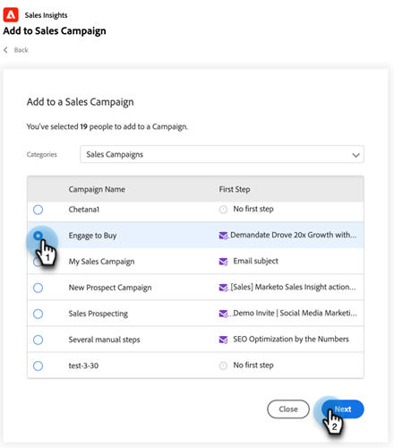

# Verwenden der Massenhinzufügung zu einer Verkaufskampagne in Salesforce {#using-bulk-add-to-sales-campaign-in-salesforce}

Erfahren Sie, wie Sie in Salesforce Massenbeiträge zu einer Verkaufskampagne hinzufügen, um Ihre ausgehende Kommunikation mithilfe von Verkaufsaktionen zu skalieren.

>[!NOTE]
>
>Salesforce erzwingt ein Limit von 200 Datensätzen, die gleichzeitig ausgewählt werden können.

>[!PREREQUISITES]
>
>Stellen Sie sicher, dass Sie das [neueste Vertriebs-Insight-Paket](/help/marketo/product-docs/marketo-sales-insight/msi-for-salesforce/upgrading/upgrading-your-msi-package.md){target="_blank"} in Ihrer Salesforce-Instanz installiert und die [Aktionsschaltflächen](/help/marketo/product-docs/marketo-sales-insight/actions/crm/salesforce-package-configuration/add-action-buttons-to-salesforce-list-view.md){target="_blank"} in Ihren Kontakt- und Lead-Listenansichten in Salesforce konfiguriert haben.

## Massenzufügung zur Verkaufskampagne in Salesforce Lightning {#bulk-add-to-sales-campaign-in-salesforce-lightning}

1. Navigieren Sie in Salesforce zur Startseite für Leads/Kontakte, indem Sie auf die Registerkarte **Leads/Kontakte** klicken.

   

1. Wählen Sie in **Dropdown** Ansicht die gewünschte Ansicht der Leads/Kontakte aus, die Sie per E-Mail versenden möchten.

   >[!TIP]
   >
   >Sie können eine neue Ansicht erstellen, indem Sie auf das Zahnradsymbol rechts klicken und **Neu** auswählen. Nachdem Sie der Ansicht einen neuen Namen gegeben und sie gespeichert haben, können Sie auf das Filtersymbol rechts klicken, um die Filterung auf die gewünschte Gruppe von Leads/Kontakten zu vereinfachen, die Sie per E-Mail versenden möchten.

1. Wählen Sie die gewünschte Lead- oder Kontaktliste aus und klicken Sie auf die Schaltfläche **Zu Vertriebskampagne hinzufügen**.

   

1. Sie werden zum Modal „Verkaufsaktion“ für Aktionen navigiert, wobei die ausgewählten Empfänger hinzugefügt werden.

1. Nehmen Sie die zum Entfernen von Personen oder Gruppen erforderlichen Änderungen vor und klicken Sie dann auf **Weiter**.

   

1. Wählen Sie die gewünschte Verkaufskampagnenkategorie aus der Dropdown-Liste Kategorien aus.

1. Wählen Sie die Verkaufskampagne aus, der Sie die ausgewählten Personen hinzufügen möchten, und klicken Sie auf **Weiter**.

   

1. Je nachdem, was der erste Schritt in Ihrer Kampagne ist, werden möglicherweise unterschiedliche Optionen angezeigt. Wenn Ihr erster Schritt eine E-Mail ist, haben Sie die Möglichkeit, die E-Mail für jeden Empfänger zu bearbeiten, wie unten dargestellt. Klicken Sie anschließend auf **Weiter**.

   

1. Wenn es sich bei Ihrem ersten Schritt um eine E-Mail handelt und Sie sie so konfiguriert haben, dass Sie auswählen können, wann die Kampagne gestartet wird, haben Sie erneut die Option **Jetzt starten** oder **Neue Startzeit planen**. Klicken Sie nach Abschluss des Vorgangs auf **Starten**.

   

Nachdem Sie auf Start geklickt haben, wird ein Bestätigungsbildschirm angezeigt, der Ihnen mitteilt, wie viele Personen hinzugefügt wurden.

## Massenzufügung zu einer Verkaufskampagne in Salesforce Classic {#bulk-add-to-sales-campaign-in-salesforce-classic}

1. Klicken Sie in Salesforce auf die Registerkarte **Leads/Kontakte**.

1. Wählen Sie in der Dropdown-Liste Ansicht die gewünschte Ansicht der Leads/Kontakte aus, die Sie per E-Mail versenden möchten, und klicken Sie auf **Los**.

   

   >[!TIP]
   >
   >Sie können eine neue Ansicht erstellen, indem Sie auf Neue Ansicht erstellen klicken und die verfügbaren Filter konfigurieren, um die Liste der Empfänger einzugrenzen, die Sie per E-Mail versenden möchten.

1. Wählen Sie die gewünschte Lead- oder Kontaktliste aus und klicken Sie auf die Schaltfläche **Zu Vertriebskampagne hinzufügen**.

   

1. Sie werden mit den von Ihnen ausgewählten Personen zum Modal „Aktionen Verkaufskampagne“ navigiert.

1. Nehmen Sie die zum Entfernen von Personen oder Gruppen erforderlichen Änderungen vor und klicken Sie dann auf **Weiter**.

   

1. Wählen Sie die gewünschte Verkaufskampagnenkategorie aus der Dropdown-Liste **Kategorien** aus.

1. Wählen Sie die Verkaufskampagne aus, der Sie die ausgewählten Personen hinzufügen möchten, und klicken Sie auf **Weiter**.

   

1. Je nachdem, was der erste Schritt in Ihrer Kampagne ist, werden möglicherweise unterschiedliche Optionen angezeigt. Wenn Ihr erster Schritt eine E-Mail ist, haben Sie die Möglichkeit, die E-Mail für jeden Empfänger zu bearbeiten, wie unten dargestellt. Klicken Sie anschließend auf **Weiter**.

   

1. Wenn es sich bei Ihrem ersten Schritt um eine E-Mail handelt und Sie sie so konfiguriert haben, dass Sie auswählen können, wann die Kampagne gestartet wird, haben Sie erneut die Option **Jetzt starten** oder **Neue Startzeit planen**. Klicken Sie nach Abschluss des Vorgangs auf **Starten**.

   

Nachdem Sie auf Start geklickt haben, wird ein Bestätigungsbildschirm angezeigt, der Ihnen mitteilt, wie viele Personen hinzugefügt wurden.

