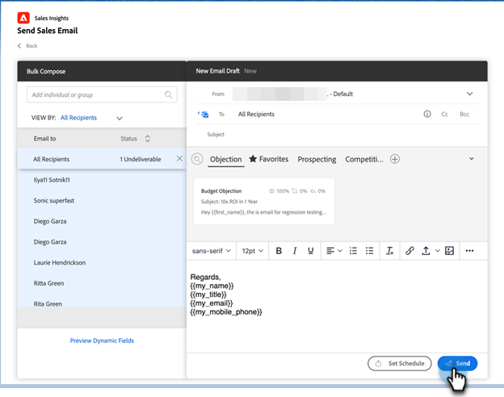
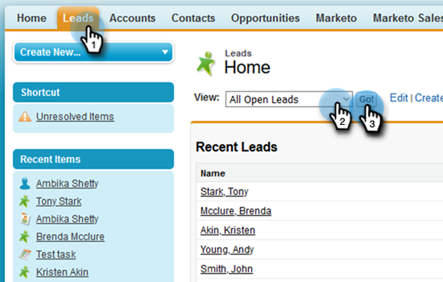

# Verwenden der Massen-Sende-Verkaufs-E-Mail in Salesforce {#using-bulk-send-sales-email-in-salesforce}

Erfahren Sie, wie Sie Massen-E-Mails in Salesforce senden können, um Ihre ausgehende Kommunikation mithilfe von Verkaufsaktionen zu skalieren.

>[!NOTE]
>
>Salesforce erzwingt eine Beschränkung von 200 Datensätzen, die gleichzeitig ausgewählt werden können.

>[!PREREQUISITES]
>
>Vergewissern Sie sich, dass Sie die [neuestes Sales Insight-Paket](/help/marketo/product-docs/marketo-sales-insight/msi-for-salesforce/upgrading/upgrading-your-msi-package.md){target="_blank"} to your Salesforce instance and have configured the [Action buttons](/help/marketo/product-docs/marketo-sales-insight/actions/crm/salesforce-package-configuration/add-action-buttons-to-salesforce-list-view.md){target="_blank"} in Ihren Kontakt- und Lead-Listenansichten in Salesforce.

## Senden von Massen-E-Mails in Salesforce-Blitzen {#sending-bulk-email-in-salesforce-lightning}

1. Navigieren Sie in Salesforce zur Startseite Leads/Kontakte , indem Sie auf die **Leads/Kontakte** Registerkarte.

   

1. Wählen Sie in der Dropdown-Liste Ansicht die gewünschte Ansicht der Leads/Kontakte aus, die Sie per E-Mail versenden möchten.

   >[!TIP]
   >
   >Sie können eine neue Ansicht erstellen, indem Sie auf das Zahnradsymbol rechts klicken und **Neu**. Nachdem Sie der Ansicht einen neuen Namen gegeben und gespeichert haben, können Sie auf das Filtersymbol rechts neben der Ansicht klicken, um nach dem gewünschten Satz von Leads/Kontakten zu filtern, die Sie per E-Mail versenden möchten.

1. Wählen Sie die gewünschte Lead- oder Kontaktliste aus und klicken Sie auf die **E-Mail zum Vertrieb senden** Schaltfläche.

   

1. Sie werden zum Fenster Aktionszusammenstellung navigiert und die von Ihnen ausgewählten Personen hinzugefügt.

1. Wählen Sie die Vorlage aus, die Sie in den Assistenten zum Erstellen von Aktionen einfügen möchten, oder schreiben Sie eine benutzerdefinierte E-Mail.

   >[!TIP]
   >
   >Verwendung [Eingegebene Kategorien](/help/marketo/product-docs/marketo-sales-insight/actions/email/using-the-compose-window/using-a-template-in-the-compose-window.md#pinning-template-categories-in-the-compose-window){target="_blank"} um den Zugriff auf Ihre bevorzugten E-Mail-Vorlagen zu erleichtern.

   **OPTIONALER SCHRITT**: Zeigen Sie eine Vorschau der Personalisierung dynamischer Felder an, indem Sie auf die Schaltfläche **Vorschau dynamischer Felder** Schaltfläche.

   >[!TIP]
   >
   >Wenn Sie eine Vorlage für alle Empfänger anpassen möchten, können Sie durch Klicken auf die Option Alle Empfänger in der Seitenleiste Massen erstellen alle Empfänger-E-Mails gleichzeitig bearbeiten. Wenn Sie eine Änderung an einer bestimmten E-Mail vornehmen möchten, klicken Sie in der Seitenleiste &quot;Massen erstellen&quot;auf den Namen oder die E-Mail des Empfängers. Wenn Sie an einer einzelnen E-Mail Änderungen vornehmen und dann bei der Auswahl von Alle Empfänger Änderungen vornehmen, überschreiben die Änderungen, die an allen Empfängern vorgenommen wurden, die an der einzelnen E-Mail vorgenommenen Änderungen.

1. Auswählen **Senden** die E-Mail unverzüglich zu senden, oder **Zeitplan festlegen** um Datum und Uhrzeit für den Versand der E-Mail festzulegen.

   

## Massen-E-Mail in Salesforce Classic senden {#sending-bulk-email-in-salesforce-classic}

1. Klicken Sie in Salesforce auf die **Leads/Kontakte** Registerkarte.

1. Wählen Sie in der Dropdownliste Ansicht die gewünschte Ansicht der Leads/Kontakte aus, die Sie per E-Mail versenden möchten, und klicken Sie auf **Los**.

   

   >[!TIP]
   >
   >Sie können eine neue Ansicht erstellen, indem Sie auf Neue Ansicht erstellen klicken und die verfügbaren Filter konfigurieren, um die Liste der Benutzer einzuschränken, die Sie zu einer Verkaufskampagne hinzufügen.

1. Wählen Sie die gewünschte Lead- oder Kontaktliste aus und klicken Sie auf die Schaltfläche **E-Mail zum Vertrieb senden** Schaltfläche.

   

1. Sie werden zum Fenster Aktionskomposition mit den im Fenster zum Erstellen ausgewählten Empfängern navigiert.

1. Wählen Sie die Vorlage aus, die Sie in den Assistenten zum Erstellen von Aktionen einfügen möchten, oder schreiben Sie eine benutzerdefinierte E-Mail.

   

   >[!TIP]
   >
   >Verwendung [Eingegebene Kategorien](/help/marketo/product-docs/marketo-sales-insight/actions/email/using-the-compose-window/using-a-template-in-the-compose-window.md#pinning-template-categories-in-the-compose-window){target="_blank"} um den Zugriff auf Ihre bevorzugten E-Mail-Vorlagen zu erleichtern.

   **OPTIONALER SCHRITT**: Zeigen Sie eine Vorschau der Personalisierung dynamischer Felder an, indem Sie auf die Schaltfläche **Vorschau dynamischer Felder** Schaltfläche.

   >[!TIP]
   >
   >Wenn Sie eine Vorlage für alle Empfänger anpassen möchten, können Sie durch Klicken auf die Option Alle Empfänger in der Seitenleiste Massen erstellen alle Empfänger-E-Mails gleichzeitig bearbeiten. Wenn Sie eine Änderung an einer bestimmten E-Mail vornehmen möchten, klicken Sie in der Seitenleiste &quot;Massen erstellen&quot;auf den Namen oder die E-Mail des Empfängers. Wenn Sie an einer einzelnen E-Mail Änderungen vornehmen und dann bei der Auswahl von Alle Empfänger Änderungen vornehmen, überschreiben die Änderungen, die an allen Empfängern vorgenommen wurden, die an der einzelnen E-Mail vorgenommenen Änderungen.

1. Auswählen **Senden** die E-Mail unverzüglich zu senden, oder **Zeitplan festlegen** um Datum und Uhrzeit für den Versand der E-Mail festzulegen.
