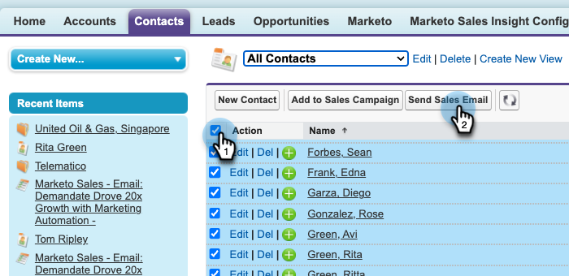

# Verwenden des Massenversands von Verkaufs-E-Mails in Salesforce {#using-bulk-send-sales-email-in-salesforce}

Erfahren Sie, wie Sie Massen-E-Mails in Salesforce senden, um Ihre ausgehende Kommunikation mithilfe von Verkaufsaktionen zu skalieren.

>[!NOTE]
>
>Salesforce erzwingt ein Limit von 200 Datensätzen, die gleichzeitig ausgewählt werden können.

>[!PREREQUISITES]
>
>Stellen Sie sicher, dass Sie das [neueste Vertriebs-Insight-Paket](/help/marketo/product-docs/marketo-sales-insight/msi-for-salesforce/upgrading/upgrading-your-msi-package.md){target="_blank"} in Ihrer Salesforce-Instanz installiert und die [Aktionsschaltflächen](/help/marketo/product-docs/marketo-sales-insight/actions/crm/salesforce-package-configuration/add-action-buttons-to-salesforce-list-view.md){target="_blank"} in Ihren Kontakt- und Lead-Listenansichten in Salesforce konfiguriert haben.

## Senden von Massen-E-Mails in Salesforce Lightning {#sending-bulk-email-in-salesforce-lightning}

1. Navigieren Sie in Salesforce zur Startseite für Leads/Kontakte, indem Sie auf die Registerkarte **Leads/Kontakte** klicken.

   

1. Wählen Sie in der Dropdown-Liste Ansicht die gewünschte Ansicht der Leads/Kontakte aus, die Sie per E-Mail versenden möchten.

   >[!TIP]
   >
   >Sie können eine neue Ansicht erstellen, indem Sie auf das Zahnradsymbol rechts klicken und **Neu** auswählen. Nachdem Sie der Ansicht einen neuen Namen gegeben und sie gespeichert haben, können Sie auf das Filtersymbol rechts klicken, um die Filterung auf die gewünschte Gruppe von Leads/Kontakten zu vereinfachen, die Sie per E-Mail versenden möchten.

1. Wählen Sie die gewünschte Lead- oder Kontaktliste aus und klicken Sie auf die Schaltfläche **Verkaufs-E-Mail senden**.

   

1. Sie werden zum Fenster „Aktionen erstellen“ mit den von Ihnen ausgewählten Personen navigiert.

1. Wählen Sie die Vorlage aus, die Sie in den Editor für das Fenster „Aktionen erstellen“ einfügen möchten, oder schreiben Sie eine benutzerdefinierte E-Mail.

   >[!TIP]
   >
   >Verwenden Sie [angeheftete Kategorien](/help/marketo/product-docs/marketo-sales-insight/actions/email/using-the-compose-window/using-a-template-in-the-compose-window.md#pinning-template-categories-in-the-compose-window){target="_blank"} um den Zugriff auf Ihre bevorzugten E-Mail-Vorlagen zu erleichtern.

   **OPTIONALER SCHRITT**: Zeigen Sie eine Vorschau einer Personalisierung für dynamische Felder an, indem Sie auf die Schaltfläche **Vorschau dynamischer Felder** klicken.

   >[!TIP]
   >
   >Wenn Sie eine Vorlage für alle Empfänger anpassen möchten, können Sie durch Klicken auf die Option Alle Empfänger in der Seitenleiste für die Massenbearbeitung alle Empfänger-E-Mails gleichzeitig bearbeiten. Wenn Sie eine Änderung an einer bestimmten E-Mail vornehmen möchten, klicken Sie auf den Namen oder die E-Mail-Adresse des Empfängers in der Seitenleiste für die Massenbearbeitung. Wenn Sie Änderungen an einer einzelnen E-Mail vornehmen und dann Änderungen vornehmen, während Sie Alle Empfänger auswählen, werden die Änderungen an der einzelnen E-Mail durch die Änderungen an allen Empfängern überschrieben.

1. Wählen Sie **Senden** aus, um die E-Mail sofort zu senden, oder **Zeitplan festlegen**, um Datum und Uhrzeit für den Versand der E-Mail festzulegen.

   

## Senden von Massen-E-Mails in Salesforce Classic {#sending-bulk-email-in-salesforce-classic}

1. Klicken Sie in Salesforce auf die Registerkarte **Leads/Kontakte**.

1. Wählen Sie in der Dropdown-Liste Ansicht die gewünschte Ansicht der Leads/Kontakte aus, die Sie per E-Mail versenden möchten, und klicken Sie auf **Los**.

   

   >[!TIP]
   >
   >Sie können eine neue Ansicht erstellen, indem Sie auf Neue Ansicht erstellen klicken und die verfügbaren Filter konfigurieren, um die Liste der Personen einzugrenzen, die Sie einer Verkaufskampagne hinzufügen.

1. Wählen Sie die gewünschte Lead- oder Kontaktliste aus und klicken Sie auf die Schaltfläche **Verkaufs-E-Mail senden**.

   

1. Sie werden zum Fenster Aktionen erstellen mit den Empfängern navigiert, die Sie im Fenster Erstellen ausgewählt haben.

1. Wählen Sie die Vorlage aus, die Sie in den Editor für das Fenster „Aktionen erstellen“ einfügen möchten, oder schreiben Sie eine benutzerdefinierte E-Mail.

   

   >[!TIP]
   >
   >Verwenden Sie [angeheftete Kategorien](/help/marketo/product-docs/marketo-sales-insight/actions/email/using-the-compose-window/using-a-template-in-the-compose-window.md#pinning-template-categories-in-the-compose-window){target="_blank"} um den Zugriff auf Ihre bevorzugten E-Mail-Vorlagen zu erleichtern.

   **OPTIONALER SCHRITT**: Zeigen Sie eine Vorschau einer Personalisierung für dynamische Felder an, indem Sie auf die Schaltfläche **Vorschau dynamischer Felder** klicken.

   >[!TIP]
   >
   >Wenn Sie eine Vorlage für alle Empfänger anpassen möchten, können Sie durch Klicken auf die Option Alle Empfänger in der Seitenleiste für die Massenbearbeitung alle Empfänger-E-Mails gleichzeitig bearbeiten. Wenn Sie eine Änderung an einer bestimmten E-Mail vornehmen möchten, klicken Sie auf den Namen oder die E-Mail-Adresse des Empfängers in der Seitenleiste für die Massenbearbeitung. Wenn Sie Änderungen an einer einzelnen E-Mail vornehmen und dann Änderungen vornehmen, während Sie Alle Empfänger auswählen, werden die Änderungen an der einzelnen E-Mail durch die Änderungen an allen Empfängern überschrieben.

1. Wählen Sie **Senden** aus, um die E-Mail sofort zu senden, oder **Zeitplan festlegen**, um Datum und Uhrzeit für den Versand der E-Mail festzulegen.
