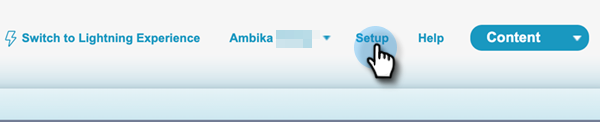
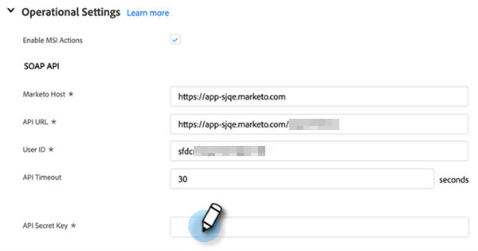

# Konfiguration von Sales Insight-Aktionen in Salesforce {#sales-insight-actions-configuration-in-salesforce}

>[!PREREQUISITES]
>
>* [Installieren](/help/marketo/product-docs/marketo-sales-insight/msi-for-salesforce/installation/install-marketo-sales-insight-package-in-salesforce-appexchange.md) oder [Upgrade](/help/marketo/product-docs/marketo-sales-insight/msi-for-salesforce/upgrading/upgrading-your-msi-package.md) Sales Insight-Paket in Ihrer Salesforce-Instanz
>* [Konfigurieren von Marketo Sales Insight in Salesforce Enterprise/Unlimited](/help/marketo/product-docs/marketo-sales-insight/msi-for-salesforce/configuration/configure-marketo-sales-insight-in-salesforce-enterprise-unlimited.md)

## Neue Remote-Site in Salesforce hinzufügen {#add-new-remote-site-in-salesforce}

1. Klicken Sie in Salesforce auf **Einrichtung**.

   

1. Suchen Sie nach &quot;Remote-Site&quot;und wählen Sie **Remote Site Settings**.
   

1. Klicken **Neue Remote-Site**.

   

1. Geben Sie den Remote-Site-Namen ein (z. B. &quot;MarketoSalesInsight&quot;). Geben Sie die Remote-Site-URL ein (https://ims-na1-stg1.adobelogin.com) und klicken Sie auf **Speichern**.

   

## Aktivierung von Sales Insight-Aktionen im gesamten CRM {#enabling-sales-insight-actions-across-the-crm}

1. Klicken Sie in Salesforce auf die **Marketo Sales Insight-Konfiguration** Registerkarte.

   

   >[!NOTE]
   >
   >Wenn Sie &quot;Marketo Sales Insight-Konfiguration&quot;nicht in Ihrer oberen Leiste sehen, klicken Sie auf die Schaltfläche **+** signieren und finden Sie es unter Alle Registerkarten .

1. Wählen Sie die **MSI-Aktionen aktivieren** aktivieren.

   

1. Geben Sie den geheimen API-Schlüssel ein.

   

   >[!NOTE]
   >
   >Wenn Sie Ihren API-Sicherheitsschlüssel nicht zur Hand haben, führen Sie die Schritte unter [diesem Artikel](/help/marketo/product-docs/marketo-sales-insight/msi-for-salesforce/configuration/configure-marketo-sales-insight-in-salesforce-enterprise-unlimited.md).

1. Klicken **Speichern** wann geschehen.

Dadurch werden automatisch alle im Artikel Funktionsübersicht beschriebenen MSI-Aktionen aktiviert.

>[!NOTE]
>
>Sie können alle MSI-Aktionen-Funktionen deaktivieren, indem Sie einfach das Kontrollkästchen &quot;MSI-Aktionen aktivieren&quot;deaktivieren.

## MSI-Actions Governance {#msi-actions-governance}

1. Sie können im nächsten Abschnitt Verkaufskampagnen und/oder die Registerkarte Aufgabe deaktivieren. Dies gilt für Lead-, Kontakt-, Konto- und Opportunity-Bereiche.

   

1. Sie können MSI-Aktionen deaktivieren, indem Sie die entsprechenden Funktionen unter Aktionseinstellungen deaktivieren.

   

>[!NOTE]
>
>Governance-Einstellungen gelten für alle MSI-Benutzer.
